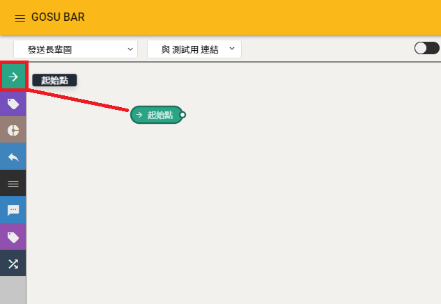
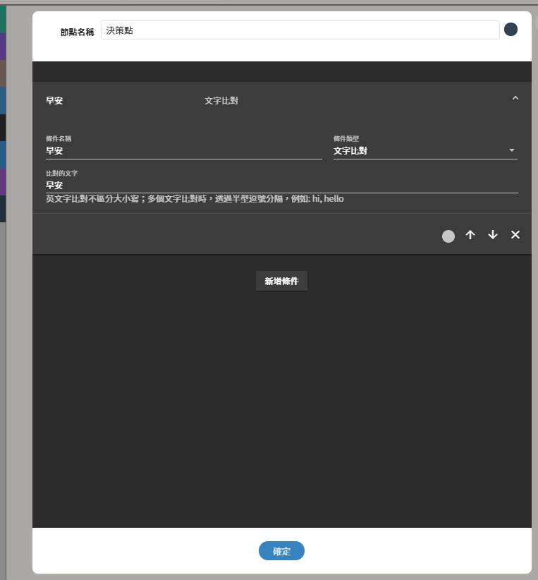
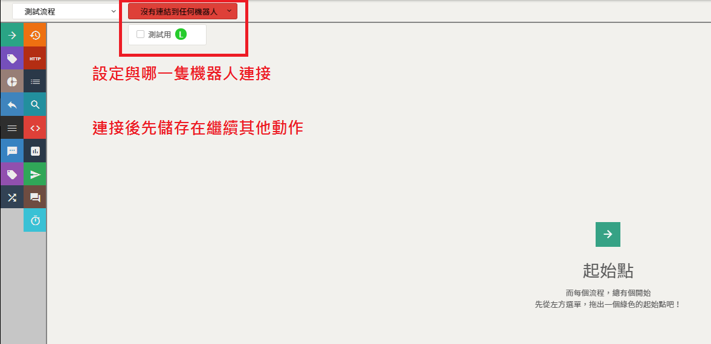

# 常見問題

## 與機器人對話設定 - 常見問題

## 流程編輯器

### 1. 忘記儲存流程

### 2. 忘記開啟專業模式

### 3. 節點設定值正確性

#### 起始點

#### 決策點設定值

1.  ​**條件類型**
2.  **​設定值**

#### 發送訊息設定值

1. **內容值**

### 4. 忘記連接機器人

## 圖像編輯器

### 1. 忘記儲存圖像

