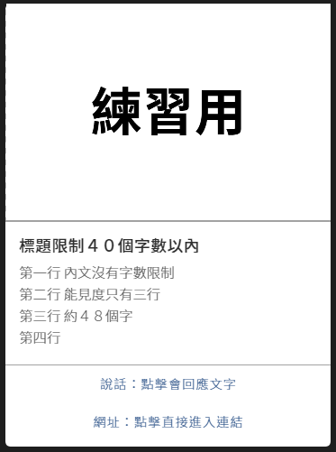

# 製作一張規則卡片

## 卡片

## 步驟教學







## 更多卡片相關應用



## 卡片詳細說明


### 1. 一組卡片能夠並排 10張

### 2. 卡片標題限制 40個字

### 3. 卡片內文沒有字數限制 , 但 Line上能見度為 3行約 48個字

### 4. 卡片若要並排按鈕數限制最多 3個 , 但單一張卡片可以到 4個按鈕

### 5. 寬 x 高 固定 \( 450 x 300 \)

### 6. 不能轉傳 或 下載


