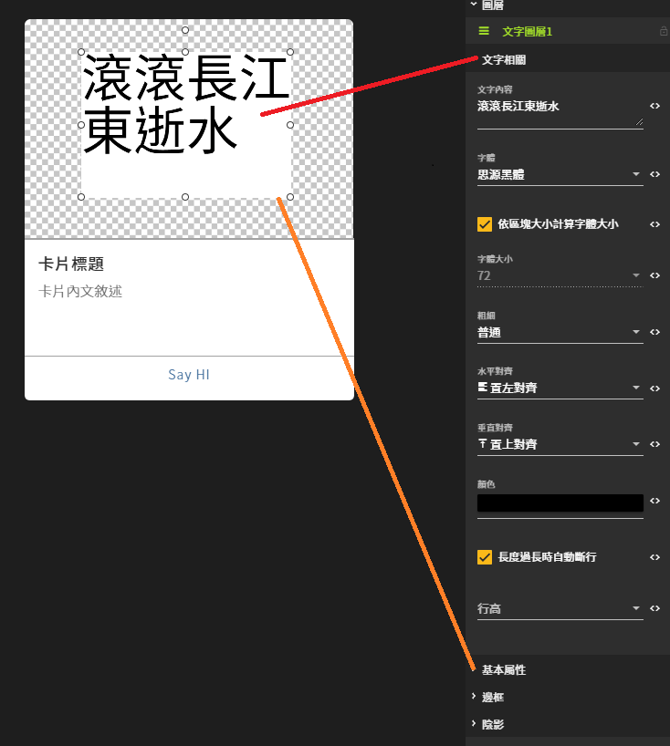

# 圖像編輯器篇

## 進入圖像編輯器

### 1. 開啟選單列表

### 2. 進入圖像編輯器

### 3. 新增卡片

### 4. 進入卡片

## 卡片底圖設定

### 新增文字

### 拖曳出文字區塊

### 調整文字區塊設定

#### 文字相關

| 列表 | 設定值 |
| :--- | :--- |
| 文字內容 | 練習用 |
| 粗細 | 粗體 |
| 水平對齊 | 置中對齊 |
| 垂直對齊 | 置中對齊 |

#### 基本屬性

| 列表 | 設定值X |
| :--- | :--- |
| X座標 | 0 |
| Y座標 | 0 |
| 寬度 | 450 |
| 高度 | 300 |

## 卡片標題、內文、按鈕設定

### 卡片

<table>
  <thead>
    <tr>
      <th style="text-align:center">&#x5217;&#x8868;</th>
      <th style="text-align:left">&#x8A2D;&#x5B9A;&#x503C;</th>
      <th style="text-align:left">&#x8AAA;&#x660E;</th>
    </tr>
  </thead>
  <tbody>
    <tr>
      <td style="text-align:center">&#x6A19;&#x984C;</td>
      <td style="text-align:left">&#x6A19;&#x984C;&#x9650;&#x5236;&#xFF14;&#xFF10;&#x500B;&#x5B57;&#x6578;&#x4EE5;&#x5167;</td>
      <td
      style="text-align:left">&#x5361;&#x7247;&#x6A19;&#x984C;</td>
    </tr>
    <tr>
      <td style="text-align:center">&#x5167;&#x6587;</td>
      <td style="text-align:left"><code>&#x7B2C;&#x4E00;&#x884C; &#x5167;&#x6587;&#x6C92;&#x6709;&#x5B57;&#x6578;&#x9650;&#x5236; &#x7B2C;&#x4E8C;&#x884C; &#x80FD;&#x898B;&#x5EA6;&#x53EA;&#x6709;&#x4E09;&#x884C; &#x7B2C;&#x4E09;&#x884C; &#x7D04;&#xFF14;&#xFF18;&#x500B;&#x5B57; &#x7B2C;&#x56DB;&#x884C;</code>
      </td>
      <td style="text-align:left">&#x5361;&#x7247;&#x5167;&#x6587;</td>
    </tr>
    <tr>
      <td style="text-align:center">&#x66FF;&#x4EE3;&#x6587;&#x5B57;</td>
      <td style="text-align:left">&#x5361;&#x7247;&#x7BC4;&#x4F8B;</td>
      <td style="text-align:left">
        
Line &#x4E0A;&#x7BC4;&#x4F8B;

        

          
        

      </td>
    </tr>
  </tbody>
</table>### 按鈕 1

| 列表 | 設定值 |
| :---: | :--- |
| 類型 | 說話 |
| 按鈕文字 | 說話：點擊會回應文字 |
| 訊息內容 | 回應文字 |

### 按鈕 2

| 列表 | 設定值 |
| :---: | :--- |
| 類型 | 連結 |
| 按鈕文字 | 網址：點擊直接進入連結 |
| 訊息內容 | [https://www.google.com.tw](https://www.google.com.tw/) |

## 儲存內容

