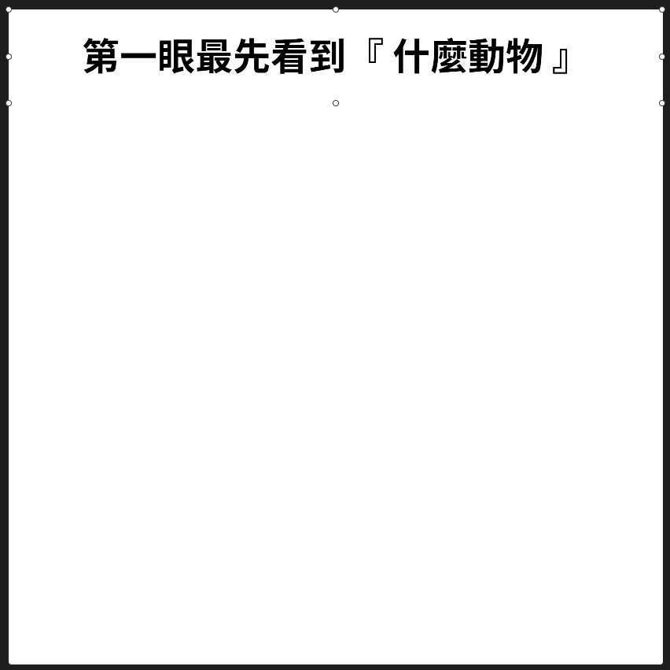
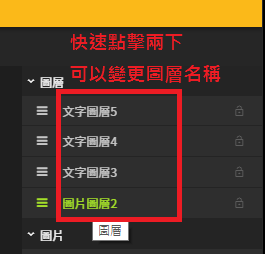

# 題目製作 - 海報

## 進入圖像編輯器

### 1. 開啟選單列表

### 2. 進入圖像編輯器

### 3. 新增海報

### 4.進入海報

## 底圖設定

### 矩形工具


### 1. 點擊 **矩形** 工具

### 2. 在白色區塊內拖曳出一個隨意大小的矩形區塊


### 矩形區塊 - 設定值

| 列表 | 設定值 |
| :--- | :--- |
| X座標 | 0 |
| Y座標 | 0 |
| 寬度 | 1040 |
| 高度 | 1040 |

## 標題設定

### 文字工具（標題）


### 1. 點擊 **文字** 工具

### 2. 白色區塊拖曳出一個文字區塊，當作標題使用



#### 1. 若拖曳出區塊後，看不到區塊，將圖層順序調整即可

#### 2. 結果呈現


### 文字區塊（標題） - 設定值

#### 文字相關

| 列表 | 設定值 |
| :--- | :--- |
| 文字內容 | 第一眼最先看到『 什麼動物 』 |
| 是否自動調整字體 | ☐ 自訂字體大小 |
| 字體大小 | 60 |
| 粗細 | 粗體 |
| 水平對齊 | 置中對齊 |
| 垂直對齊 | 置中對齊 |

#### 基本屬性

| 列表 | 設定值 |
| :--- | :--- |
| X座標 | 0 |
| Y座標 | 0 |
| 寬度 | 1040 |
| 高度 | 150 |

## 圖片設定

### 新增圖片


### 1. 點擊 圖片 工具

### 2. 拖曳出圖片區塊



#### 1. 若拖曳出區塊後，看不到區塊，將圖層順序調整即可

#### 2. 結果呈現


### 圖片區塊 - 設定值

#### 本地上傳 或 貼上網址

#### 圖片

| 列表 | 設定值 |
| :---: | :---: |
| 圖片網址 |   |
| 裁切方式 | 符合大小 |

#### 基本屬性

| 列表 | 設定值 |
| :--- | :--- |
| X座標 | 0 |
| Y座標 | 150 |
| 寬度 | 1040 |
| 高度 | 540 |

## 答案設定

### 新增文字（答案）


### 1. 點擊 文字 工具

### 2. 建立五個文字區塊，當作按鈕使用


### 文字區塊（答案） - 設定值

#### 文字相關

| 區塊 | 文字內容 | 是否自動調整字體 | 字體大小 | 粗細 | 水平對齊 | 垂直對齊 |
| :---: | :---: | :---: | :---: | :---: | :---: | :---: |
| 熊 | 熊 | ☐ 自訂字體大小 | 48 | 粗體 | 置中對齊 | 置中對齊 |
| 鹿 | 鹿 | ☐ 自訂字體大小 | 48 | 粗體 | 置中對齊 | 置中對齊 |
| 狼 | 狼 | ☐ 自訂字體大小 | 48 | 粗體 | 置中對齊 | 置中對齊 |
| 鳥 | 鳥 | ☐ 自訂字體大小 | 48 | 粗體 | 置中對齊 | 置中對齊 |
| 狐狸 | 狐狸 | ☐ 自訂字體大小 | 48 | 粗體 | 置中對齊 | 置中對齊 |

#### 基本屬性

| 區塊 | X座標 | Y座標 | 寬度 | 高度 |
| :---: | :---: | :---: | :---: | :---: |
| 熊 | 30 | 780 | 300 | 100 |
| 鹿 | 370 | 780 | 300 | 100 |
| 狼 | 710 | 780 | 300 | 100 |
| 鳥 | 190 | 910 | 300 | 100 |
| 狐狸 | 550 | 910 | 300 | 100 |

#### 點擊行為

| 區塊 | 點擊行為 | 對話內容 |
| :---: | :---: | :---: |
| 熊 | 說話 | 熊 |
| 鹿 | 說話 | 鹿 |
| 狼 | 說話 | 狼 |
| 鳥 | 說話 | 鳥 |
| 狐狸 | 說話 | 狐狸 |

#### 邊框

| 區塊 | 樣式 | 寬度 | 顏色 |
| :---: | :---: | :---: | :---: |
| 熊 | 實線 | 8 | \#000000 |
| 鹿 | 實線 | 8 | \#000000 |
| 狼 | 實線 | 8 | \#000000 |
| 鳥 | 實線 | 8 | \#000000 |
| 狐狸 | 實線 | 8 | \#000000 |

## 修改圖層名稱

### 圖層名稱說明

### 圖層設定值

##  儲存設定


### 1. 點擊儲存按紐

### 2. 等待右下角提醒視窗即可


