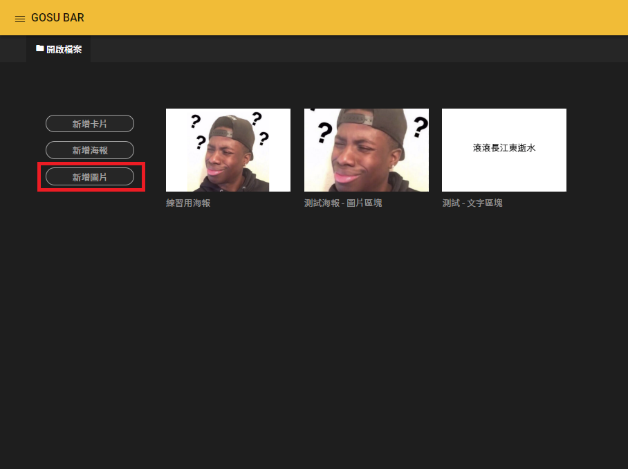
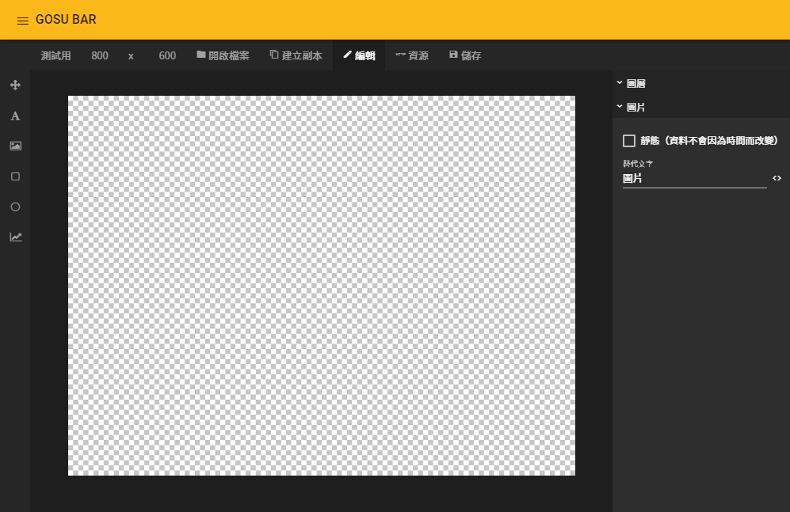
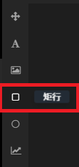
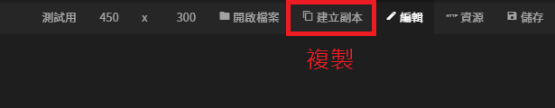
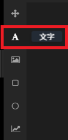
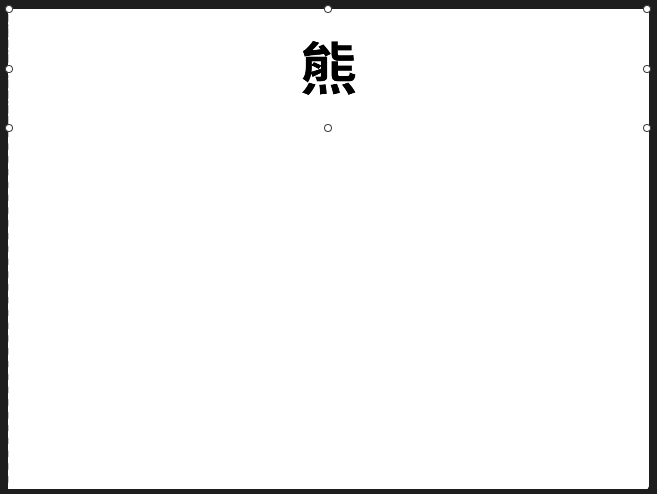
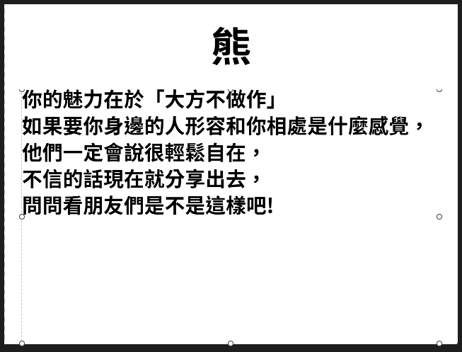
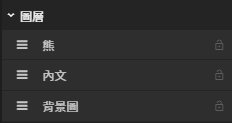

# 答案製作 - 圖片

## 進入圖像編輯器

### 1. 開啟選單列表

### 2. 進入圖像編輯器

### 3. 新增圖片

### 4. 進入圖片

## 底圖設定

### 新增矩形（背景圖）

### 矩形區塊（背景圖） - 設定值

#### 基本屬性

| 列表 | 設定值 |
| :--- | :--- |
| X座標 | 0 |
| Y座標 | 0 |
| 寬度 | 800 |
| 高度 | 600 |


五張圖片設定值一致


## 複製圖像功能說明

### 選單列 - 建立副本


### 1. 需要先儲存才能使用

### 2. 複製出來的圖像檔名會多`_複製 (舉例:測試用_複製)`


## 標題設定

### 新增文字（標題）

### 文字區塊（標題） - 設定值

#### 文字相關

| 文字區塊 | 文字內容 | 粗細 | 水平對齊 | 垂直對齊 |
| :---: | :---: | :---: | :---: | :---: |
| 熊 | 熊 | 粗體 | 置中對齊 | 置中對齊 |
| 鹿 | 鹿 | 粗體 | 置中對齊 | 置中對齊 |
| 狼 | 狼 | 粗體 | 置中對齊 | 置中對齊 |
| 鳥 | 鳥 | 粗體 | 置中對齊 | 置中對齊 |
| 狐狸 | 狐狸 | 粗體 | 置中對齊 | 置中對齊 |

#### 基本屬性

| 區塊 | X座標 | Y座標 | 寬度 | 高度 |
| :---: | :---: | :---: | :---: | :---: |
| 熊 | 0 | 0 | 800 | 150 |
| 鹿 | 0 | 0 | 800 | 150 |
| 狼 | 0 | 0 | 800 | 150 |
| 鳥 | 0 | 0 | 800 | 150 |
| 狐狸 | 0 | 0 | 800 | 150 |

## 內文設定

### 新增文字（內文）

### 文字區塊（內文） - 設定值

#### 文字相關

| 文字區塊 | 文字內容 | 是否自動調整字體 | 字體大小 | 粗細 | 行高 |
| :---: | :--- | :---: | :---: | :---: | :---: |
| 熊 | `你的魅力在於「大方不做作」 如果要你身邊的人形容和你相處是什麼感覺， 他們一定會說很輕鬆自在， 不信的話現在就分享出去， 問問看朋友們是不是這樣吧!` | ☐ 自訂字體大小 | 36 | 粗體 | 130 |
| 鹿 | `你是「天生搞笑家」 你的外貌長得很不錯， 但總是會有一些令人噴飯的舉止， 因為和你的外貌很對比， 讓人更覺得好笑，像是走樓梯會跌倒， 或是在很嚴肅的對話中台灣國語這一類的， 反正你身邊的人都覺得和你在一起很開心!` | ☐ 自訂字體大小 | 36 | 粗體 | 130 |
| 狼 | `你的魅力在於「非凡的氣質」！ 你是一個很奇妙的人，不認識你的時候， 會覺得你有一種距離感， 但是又不自覺地想往你靠近， 想要多認識你一點，在認識你之後， 那份先前的距離感就會一掃而空， 同時發掘出你顯著的個人特色， 總之你在同儕中非常有存在感，很引人注目!` | ☐ 自訂字體大小 | 36 | 粗體 | 130 |
| 鳥 | `你的魅力在於「說話技巧高超」 你全身上下最珍貴的資產就是你的嘴巴， 你身邊傷心的人喜歡找你傾訴， 因為你總人站在對方的立場冷靜地幫朋友分析， 即使講出來的話有一點殘忍， 你也能講得讓他聽得下去，而不至於太難過； 開心的時候只要有你在現場， 現場就會變得很熱鬧~ 你的話語總能吸引全場注意， 進而被你影響呢!說個說話很有份量的人~` | ☐ 自訂字體大小 | 36 | 粗體 | 130 |
| 狐狸 | `你受歡迎的原因是「無微不至雪中送暖」 你在群體中算是低調的人， 但你總是最關心大家的人， 總能第一個察覺團體中氛圍出現變化， 像是有人吵架了，或是失戀了， 你都會馬上知道，你很會看臉色，很少得罪人。 有時候會嚇到身邊的朋友， 因為發生了什麼你都知道， 所以講出來的話特別讓人感到語出驚人， 你就是同儕中的調和劑兼暖暖包， 不信的話現在就分享出去， 問問看身邊的朋友是不是這樣吧!` | ☐ 自訂字體大小 | 36 | 粗體 | **120** |


此處為了方便顯示，文字內容自行調整間隔


#### 基本屬性

| 區塊 | X座標 | Y座標 | 寬度 | 高度 |
| :---: | :---: | :---: | :---: | :---: |
| 熊 | 30 | 150 | 740 | 450 |
| 鹿 | 30 | 150 | 740 | 450 |
| 狼 | 30 | 150 | 740 | 450 |
| 鳥 | 30 | 150 | 740 | 450 |
| 狐狸 | 30 | 150 | 740 | 450 |

## 修改圖層名稱

### 圖層說明

### 圖層設定值

## 儲存變更


此流程須建立**五張圖片，熊、鹿、狼、鳥、狐狸**。


