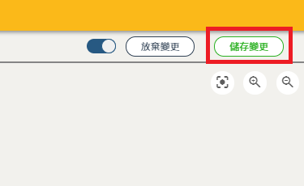

# 回應設定方式

### 

## 流程設定

### 1. 開啟選單列表

### 2. 進入流程編輯器

### 3. 新增流程

### 4. 流程與機器人連接

### 5. 儲存流程


## 定時的按下儲存，是一個良好的習慣


## 起始值設定

### 建立起始點

### 起始點 - 設定值

#### 快速點擊兩下進入節點設定內容

## 決策點設定

### 建立決策點

### 決策點 - 設定值

| 條件判斷 | 條件名稱 | 條件類型 | 比對的文字 |
| :--- | :--- | :--- | :--- |
| 條件一 | 心理測驗 | 文字比對 | 心理測驗 |
| 條件二 | 熊 | 文字比對 | 熊 |
| 條件三 | 鹿 | 文字比對 | 鹿 |
| 條件四 | 狼 | 文字比對 | 狼 |
| 條件五 | 鳥 | 文字比對 | 鳥 |
| 條件六 | 狐狸 | 文字比對 | 狐狸 |


決策點節點，  
有優先順序，順序由上而下  
先觸發先進入條件


## 發送訊息設定（題目）

### 建立發送訊息


### 1. 點擊 新增圖像範例

### 2. 選擇 剛完成的心理測驗 \( 題目 \)


### 發送訊息 - 設定值

| 發送訊息節點 | 節點名稱 | 圖像範本 |
| :---: | :---: | :---: |
| 什麼動物 | 什麼動物 | 海報 - 什麼動物 |


### 節點名稱修改後 , 發送訊息節點也修改


## 發送訊息設定（答案）

### 建立發送訊息


### 1. 點擊 新增圖像範例

### 2. 選擇 剛完成的心理測驗 \( 答案 \)


### 發送訊息 - 設定值

| 發送訊息節點 | 節點名稱 | 圖像範本 |
| :---: | :---: | :---: |
| 熊 | 熊 | 圖片 - 熊 |
| 鹿 | 鹿 | 圖片 - 鹿 |
| 狼 | 狼 | 圖片 - 狼 |
| 鳥 | 鳥 | 圖片 - 鳥 |
| 狐狸 | 狐狸 | 圖片 - 狐狸 |


### 節點名稱修改後 , 發送訊息節點也修改


## 連連看

## 儲存流程

