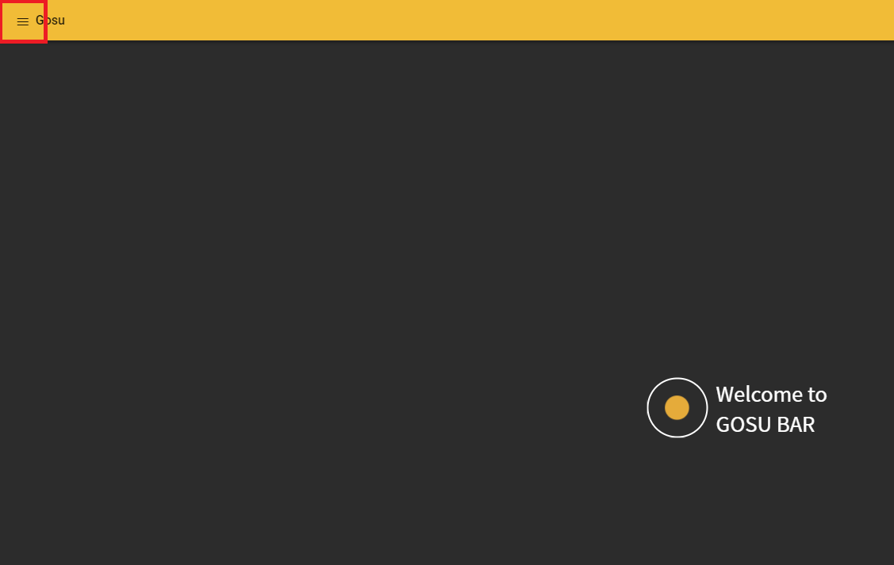
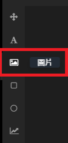
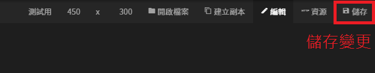

# 題目製作 - 卡片

### 進入圖像編輯器

### 1. 開啟選單列表

### 2. 進入圖像編輯器

### 3. 新增卡片

### 4. 進入卡片

## 複製圖像功能說明

### 選單列 - 建立副本


### 1. 需要先儲存才能使用

### 2. 複製出來的圖像檔名會多`_複製 (舉例:測試用_複製)`


## 圖片設定

### 建立圖片 - 兩張卡片

### 上傳圖片（右方設定列）

### 圖片區塊 - 設定值  

#### 圖片

| 卡片 | 圖片網址 | 裁切方式 |
| :---: | :---: | :---: |
| 憂鬱指數 |   | 填滿 |
| EQ測試 |    | 符合大小 |

#### 基本屬性

| 卡片 | X座標 | Y座標 | 寬度 | 高度 |
| :--- | :---: | :---: | :---: | :---: |
| 憂鬱指數 | 0 | 0 | 450 | 300 |
| EQ測試 | 0 | 0 | 450 | 300 |

## 卡片標題、內文、按鈕設定

### 兩張卡片設定值

  
 ​ ​

#### 卡片

| 卡片 | 標題 | 內文 | 替代文字 |
| :--- | :--- | :--- | :--- |
| 憂鬱指數 | 你認為自己的憂鬱指數有多少？ | `假如電視新聞說有一種飲料被人下毒， 你直覺是哪一種？ A：提神飲料 B：礦泉水 C：茶` | 憂鬱指數 |
| EQ測試 | EQ測試 | `框裡的這個人在幾樓？ A：1樓 B：2樓 C：都不是` | EQ測試 |

#### 按鈕 1

| 卡片 | 類型 | 按鈕文字 | 訊息內容 |
| :--- | :--- | :--- | :--- |
| 憂鬱指數 | 說話 | A：提神飲料 | A：提神飲料 |
| EQ測試 | 說話 | A：１樓 | A：1樓 |

#### 按鈕 2

| 卡片 | 類型 | 按鈕文字 | 訊息內容 |
| :--- | :--- | :--- | :--- |
| 憂鬱指數 | 說話 | B：礦泉水 | B：礦泉水 |
| EQ測試 | 說話 | B：２樓 | B：2樓 |

#### 按鈕 3

| 卡片 | 類型 | 按鈕文字 | 訊息內容 |
| :--- | :--- | :--- | :--- |
| 憂鬱指數 | 說話 | C：茶 | C：茶 |
| EQ測試 | 說話 | C：都不是 | C：都不是 |

## 儲存變更

