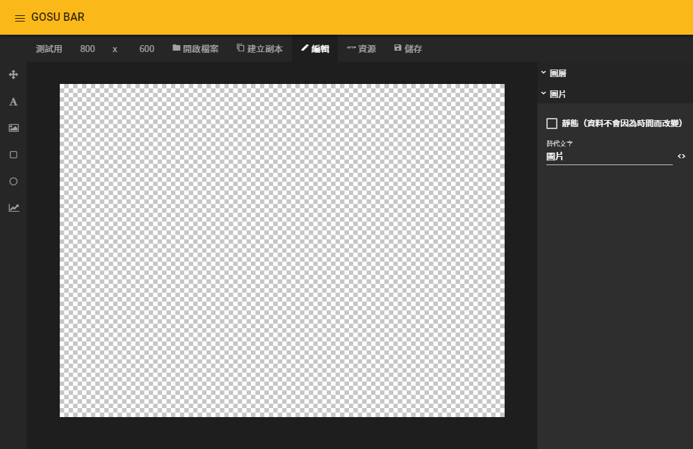
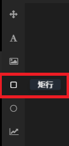

# 答案製作 - 圖片

### 進入圖像編輯器

### 1. 開啟選單列表

### 2. 進入圖像編輯器

### 3. 新增圖片

### 4. 進入圖片

## 底圖設定

### 新增矩形（背景圖）

### 矩形區塊（背景圖） - 設定值

#### 基本屬性

| 列表 | 設定值 |
| :--- | :--- |
| X座標 | 0 |
| Y座標 | 0 |
| 寬度 | 800 |
| 高度 | 600 |


六張圖片設定值一致 , 可以利用建立副本來複製


## 複製圖像功能說明

### 選單列 - 建立副本


### 1. 需要先儲存才能使用

### 2. 複製出來的圖像檔名會多`_複製 (舉例:測試用_複製)`


## 標題設定

### 新增文字（標題）


### 白色區塊中拖曳出一個文字範圍


### 調整文字區塊圖層


### 將文字區塊調整至上層 , 為了檢視與設定


### 文字區塊（標題） - 設定值

#### 文字相關

| 文字區塊 | 文字內容 | 粗細 | 水平對齊 | 垂直對齊 |
| :---: | :---: | :---: | :---: | :---: |
| 提神飲料 | 提神飲料 | 粗體 | 置中對齊 | 置中對齊 |
| 礦泉水 | 礦泉水 | 粗體 | 置中對齊 | 置中對齊 |
| 茶 | 茶 | 粗體 | 置中對齊 | 置中對齊 |
| 1樓 | 1樓 | 粗體 | 置中對齊 | 置中對齊 |
| 2樓 | 2樓 | 粗體 | 置中對齊 | 置中對齊 |
| 都不是 | 都不是 | 粗體 | 置中對齊 | 置中對齊 |

#### 基本屬性

| 區塊 | X座標 | Y座標 | 寬度 | 高度 |
| :---: | :---: | :---: | :---: | :---: |
| 提神飲料 | 0 | 0 | 800 | 150 |
| 礦泉水 | 0 | 0 | 800 | 150 |
| 茶 | 0 | 0 | 800 | 150 |
| 1樓 | 0 | 0 | 800 | 150 |
| 2樓 | 0 | 0 | 800 | 150 |
| 都不是 | 0 | 0 | 800 | 150 |

## 內文設定

### 新增文字（內文）


### 白色區塊中拖曳出一個文字範圍


### 調整文字區塊圖層


### 將文字區塊調整至上層 , 為了檢視與設定


### 文字區塊（內文） - 設定值

#### 文字相關

<table>
  <thead>
    <tr>
      <th style="text-align:center">&#x6587;&#x5B57;&#x5340;&#x584A;</th>
      <th style="text-align:left">&#x6587;&#x5B57;&#x5167;&#x5BB9;</th>
      <th style="text-align:center">&#x662F;&#x5426;&#x81EA;&#x52D5;&#x8ABF;&#x6574;&#x5B57;&#x9AD4;</th>
      <th
      style="text-align:center">&#x5B57;&#x9AD4;&#x5927;&#x5C0F;</th>
        <th style="text-align:center">&#x7C97;&#x7D30;</th>
        <th style="text-align:center">&#x884C;&#x9AD8;</th>
    </tr>
  </thead>
  <tbody>
    <tr>
      <td style="text-align:center">&#x63D0;&#x795E;&#x98F2;&#x6599;</td>
      <td style="text-align:left"><code>&#x6182;&#x9B31;&#x6307;&#x6578;80% &#x4F60;&#x9019;&#x985E;&#x578B;&#x7684;&#x4EBA;&#xFF0C;&#x500B;&#x6027;&#x5F88;&#x7D30;&#x81A9;&#x654F;&#x611F;&#xFF0C; &#x5F88;&#x5BB9;&#x6613;&#x56F0;&#x5728;&#x81EA;&#x5DF1;&#x7684;&#x4E16;&#x754C;&#x88E1;&#xFF0C;&#x8D70;&#x4E0D;&#x51FA;&#x4F86;&#xFF0C; &#x51E1;&#x4E8B;&#x5BB9;&#x6613;&#x5F80;&#x60B2;&#x89C0;&#x7684;&#x65B9;&#x5411;&#x53BB;&#x60F3;&#x3002;</code>
      </td>
      <td style="text-align:center">&#x2610; &#x81EA;&#x8A02;&#x5B57;&#x9AD4;&#x5927;&#x5C0F;</td>
      <td style="text-align:center">48</td>
      <td style="text-align:center">&#x7C97;&#x9AD4;</td>
      <td style="text-align:center">130</td>
    </tr>
    <tr>
      <td style="text-align:center">&#x7926;&#x6CC9;&#x6C34;</td>
      <td style="text-align:left"><code>&#x6182;&#x9B31;&#x6307;&#x6578;55% &#x4F60;&#x9019;&#x985E;&#x578B;&#x7684;&#x4EBA;&#x500B;&#x6027;&#x6A02;&#x89C0;&#x958B;&#x6717;&#xFF0C; &#x4E0D;&#x904E;&#x552F;&#x4E00;&#x7684;&#x6B7B;&#x7A74;&#x5C31;&#x662F;&#x611F;&#x60C5;&#xFF0C; &#x7576;&#x611F;&#x60C5;&#x78B0;&#x4E0A;&#x554F;&#x984C;&#x6642;&#xFF0C; &#x6703;&#x9677;&#x5165;&#x4F4E;&#x6F6E;&#x3001;&#x66AB;&#x6642;&#x6027;&#x7684;&#x6182;&#x9B31;&#xFF0C; &#x4E0D;&#x904E;&#x6642;&#x9593;&#x53EF;&#x4EE5;&#x89E3;&#x6C7A;&#x4E00;&#x5207;&#x3002;</code>
      </td>
      <td style="text-align:center">&#x2610; &#x81EA;&#x8A02;&#x5B57;&#x9AD4;&#x5927;&#x5C0F;</td>
      <td style="text-align:center">48</td>
      <td style="text-align:center">&#x7C97;&#x9AD4;</td>
      <td style="text-align:center">130</td>
    </tr>
    <tr>
      <td style="text-align:center">&#x8336;</td>
      <td style="text-align:left">
        
<code>&#x6182;&#x9B31;&#x6307;&#x6578;10% &#x4F60;&#x9019;&#x985E;&#x578B;&#x7684;&#x4EBA;&#xFF0C;&#x7D93;&#x904E;&#x4E86;&#x8A31;&#x591A;&#x98A8;&#x98A8;&#x96E8;&#x96E8;&#x4E4B;&#x5F8C;&#xFF0C; &#x5C0D;&#x81EA;&#x5DF1;&#x975E;&#x5E38;&#x77E5;&#x8DB3;&#xFF0C;&#x62B1;&#x6301;&#x8457;&#x611F;&#x6069;&#x7684;&#x5FC3;&#x60C5;&#xFF0C; &#x4EFB;&#x4F55;&#x4E8B;&#x60C5;&#x767C;&#x751F;&#x5728;&#x81EA;&#x5DF1;&#x8EAB;&#x4E0A;&#xFF0C;</code>
        

        
<code>&#x5C31;&#x5982;&#x540C;&#x4E0A;&#x5929;&#x7684;&#x6069;&#x8CDC;&#xFF0C;&#x56E0;&#x6B64;&#x4E0D;&#x6703;&#x6709;&#x6182;&#x9B31;&#x50BE;&#x5411;&#x3002;</code>
        

      </td>
      <td style="text-align:center">&#x2610; &#x81EA;&#x8A02;&#x5B57;&#x9AD4;&#x5927;&#x5C0F;</td>
      <td style="text-align:center">48</td>
      <td style="text-align:center">&#x7C97;&#x9AD4;</td>
      <td style="text-align:center">130</td>
    </tr>
    <tr>
      <td style="text-align:center">1&#x6A13;</td>
      <td style="text-align:left"><code>&#x51B7;&#x975C;&#x4EE5;&#x5C0D;&#xFF01; &#x4F60;&#x662F;&#x4E0D;&#x592A;&#x6703;&#x53D7;&#x611F;&#x60C5;&#x56F0;&#x64FE;&#x7684;&#x4EBA;&#xFF0C; &#x61C9;&#x8A72;&#x8AAA;&#x662F;&#x5FC3;&#x795E;&#x5B89;&#x5BE7;&#x7684;&#x4EBA;&#x5427;&#xFF01;&#x7576;&#x7136;&#x5566;&#xFF0C; &#x4F60;&#x7684;&#x51B7;&#x975C;&#x4E14;&#x3001;&#x5C31;&#x4E8B;&#x8AD6;&#x4E8B;&#x662F;&#x6700;&#x5927;&#x7684;&#x95DC;&#x9375;&#xFF0C; &#x4F60;&#x80FD;&#x5920;&#x5728;&#x4E8B;&#x60C5;&#x767C;&#x751F;&#x6642;&#xFF0C;&#x5C07;&#x81EA;&#x5DF1;&#x5C0E;&#x5411;&#x7406;&#x667A;&#x601D;&#x8003;&#xFF0C; &#x4E0D;&#x5E36;&#x5165;&#x592A;&#x591A;&#x7684;&#x611F;&#x60C5;&#x4F5C;&#x7528;&#xFF0C;&#x9019;&#x9EDE;&#x662F;&#x5F88;&#x96E3;&#x5F97;&#x7684;&#x3002;</code>
      </td>
      <td style="text-align:center">&#x2610; &#x81EA;&#x8A02;&#x5B57;&#x9AD4;&#x5927;&#x5C0F;</td>
      <td style="text-align:center">36</td>
      <td style="text-align:center">&#x7C97;&#x9AD4;</td>
      <td style="text-align:center">130</td>
    </tr>
    <tr>
      <td style="text-align:center">2&#x6A13;</td>
      <td style="text-align:left"><code>&#x5FCD;&#x8010;&#x904E;&#x5EA6;&#xFF01; &#x4F60;&#x7684;&#x60C5;&#x611F;&#x63A7;&#x5236;&#x80FD;&#x529B;&#x5F88;&#x9AD8;&#xFF0C;&#x9019;&#x4E5F;&#x610F;&#x5473;&#x8457;&#xFF0C; &#x4F60;&#x6703;&#x5C07;&#x904E;&#x591A;&#x7684;&#x4E0D;&#x6109;&#x5FEB;&#x7A4D;&#x58D3;&#x5728;&#x5FC3;&#x4E2D;&#xFF0C; &#x5F37;&#x8FEB;&#x81EA;&#x5DF1;&#x53BB;&#x6D88;&#x5316;&#x6389;&#x9019;&#x4E9B;&#x60C5;&#x7DD2;&#x5783;&#x573E;&#x3002; &#x7E3D;&#x662F;&#x5FCD;&#x8010;&#x7D55;&#x4E0D;&#x662F;&#x8FA6;&#x6CD5;&#xFF0C; &#x53EA;&#x6703;&#x8B93;&#x5C0D;&#x65B9;&#x66F4;&#x4E0D;&#x77AD;&#x89E3;&#x4F60;&#x7684;&#x5FC3;&#x60C5;&#x800C;&#x5DF2;&#x3002; &#x9069;&#x7576;&#x7684;&#x767C;&#x6D29;&#x662F;&#x5F88;&#x91CD;&#x8981;&#xFF0C;&#x9700;&#x8981;&#x597D;&#x597D;&#x5B78;&#x7FD2;&#x5537;&#xFF01;</code>
      </td>
      <td style="text-align:center">&#x2610; &#x81EA;&#x8A02;&#x5B57;&#x9AD4;&#x5927;&#x5C0F;</td>
      <td style="text-align:center">36</td>
      <td style="text-align:center">&#x7C97;&#x9AD4;</td>
      <td style="text-align:center">130</td>
    </tr>
    <tr>
      <td style="text-align:center">&#x90FD;&#x4E0D;&#x662F;</td>
      <td style="text-align:left"><code>&#x5FEB;&#x5200;&#x65AC;&#x4E82;&#x9EBB;&#xFF01; &#x4F60;&#x662F;&#x60C5;&#x611F;&#x6FC0;&#x70C8;&#x7684;&#x4EBA;&#x3002;&#x9047;&#x5230;&#x96E3;&#x4EE5;&#x89E3;&#x6C7A;&#x7684;&#x554F;&#x984C;&#x6642;&#xFF0C; &#x4F60;&#x5E38;&#x5E38;&#x6703;&#x6709;&#x8C41;&#x51FA;&#x53BB;&#x5927;&#x9B27;&#x4E00;&#x5834;&#x7684;&#x60F3;&#x6CD5;&#x3002; &#x5927;&#x9B27;&#x4E4B;&#x5F8C;&#x5012;&#x4E5F;&#x4E7E;&#x8106;&#xFF0C;&#x5C31;&#x662F;&#x4E00;&#x5200;&#x5169;&#x65B7;&#xFF0C; &#x5F9E;&#x6B64;&#x4F86;&#x500B;&#x76F8;&#x61C9;&#x4E0D;&#x7406;&#x3002;&#x8981;&#x4E0D;&#x5C31;&#x5F88;&#x6EAB;&#x67D4;&#x71B1;&#x60C5;&#xFF0C; &#x8981;&#x4E0D;&#x5C31;&#x5F88;&#x51B7;&#x6DE1;&#xFF0C;&#x597D;&#x60E1;&#x5206;&#x660E;&#x3002; EQ&#x503C;&#x8D77;&#x4F0F;&#x5F88;&#x5927;&#xFF0C;&#x6349;&#x6478;&#x4E0D;&#x5B9A;&#x3002;</code>
      </td>
      <td style="text-align:center">&#x2610; &#x81EA;&#x8A02;&#x5B57;&#x9AD4;&#x5927;&#x5C0F;</td>
      <td style="text-align:center">36</td>
      <td style="text-align:center">&#x7C97;&#x9AD4;</td>
      <td style="text-align:center">130</td>
    </tr>
  </tbody>
</table>
此處為了方便顯示，文字內容自行調整區隔


#### 基本屬性

| 區塊 | X座標 | Y座標 | 寬度 | 高度 |
| :---: | :---: | :---: | :---: | :---: |
| 提神飲料 | 50 | 150 | 700 | 450 |
| 礦泉水 | 50 | 150 | 700 | 450 |
| 茶 | 50 | 150 | 700 | 450 |
| 1樓 | 50 | 150 | 700 | 450 |
| 2樓 | 50 | 150 | 700 | 450 |
| 都不是 | 50 | 150 | 700 | 450 |

## 儲存變更


此流程須建立六**張圖片，提神飲料、礦泉水、茶、1樓、都不是**。


