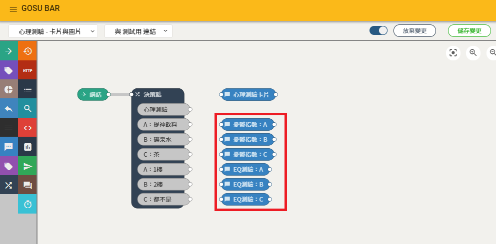

# 回應設定方式

## 流程設定

### 1. 開啟選單列表

### 2. 進入流程編輯器

### 3. 新增流程

### 4. 流程與機器人連接

### 5. 儲存流程


## 定時的按下儲存，是一個良好的習慣


## 起始點設定

### 建立起始點

### 起始點 - 設定值

#### 快速點擊兩下進入節點設定內容

## 決策點設定

### 建立決策點

### 決策點 - 設定值（七個條件判斷）

| 條件判斷 | 條件名稱 | 條件類型 | 比對的文字 |
| :--- | :--- | :--- | :--- |
| 條件一 | 心理測驗 | 文字比對 | 心理測驗 |
| 條件二 | A：提神飲料 | 文字比對 | A：提神飲料 |
| 條件三 | B：礦泉水 | 文字比對 | B：礦泉水 |
| 條件四 | C：茶 | 文字比對 | C：茶 |
| 條件五 | A：1樓 | 文字比對 | A：1樓 |
| 條件六 | B：2樓 | 文字比對 | B：2樓 |
| 條件七 | C：都不是 | 文字比對 | C：都不是 |


決策點節點，  
有優先順序，順序由上而下  
先觸發先進入條件


## 開啟專家模式


### 專家模式 , 可以設定更多節點細項


## 發送訊息設定 \(題目\)

### 建立發送訊息


### 1. 點擊 新增圖像範本

### 2. 選擇題目的圖像範本   



### 此處的疊加器名稱需依照下方 [發送疊加器設定](https://imaging.gitbook.io/imaging/~/edit/drafts/-LNwtiuDu6RKX6jRJ9m8/cheng-jiao/ka-pian-hai-mei-shi-pian/3.-liu-cheng-qi#song-jia-qi-ding) 

### 否則無法疊加


### 發送訊息 \( 題目 \) - 設定值


| 發送訊息節點 | 節點名稱 | 疊加器名稱 | 圖像範本 |
| :--- | :--- | :--- | :--- |
| 心理測驗卡片 | 心理測驗卡片 | cards | 憂鬱指數 和 EQ測試 |

### 節點名稱修改後 , 發送訊息節點也修改


## 發送訊息設定 \(答案\)

### 建立發送訊息

### 發送訊息 \( 答案 \) - 設定值


| 發送訊息節點 | 節點名稱 | 圖像範本 |
| :---: | :---: | :---: |
| 憂鬱指數：A | 憂鬱指數：A | 憂鬱指數：答案A |
| 憂鬱指數：B | 憂鬱指數：B | 憂鬱指數：答案B |
| 憂鬱指數：C | 憂鬱指數：C | 憂鬱指數：答案C |
| EQ測驗：A | EQ測驗：A | EQ測驗：答案A |
| EQ測驗：B | EQ測驗：B | EQ測驗：答案B |
| EQ測驗：C | EQ測驗：C | EQ測驗：答案C |

### 節點名稱修改後 , 發送訊息節點也修改


## 發送疊加器設定

### 建立發送疊加器

### 發送疊加器 - 設定值

| 列表 | 設定值 |
| :--- | :--- |
| 節點名稱 | 發送疊加器（預設值） |
| 疊加器名稱 | cards |
| 卡片疊加限制 | 10 |

## 連連看

## 儲存流程

