# 回應設定方式

## 流程設定

### 1. 開啟選單列表

### 2. 進入流程編輯器

### 3. 新增流程

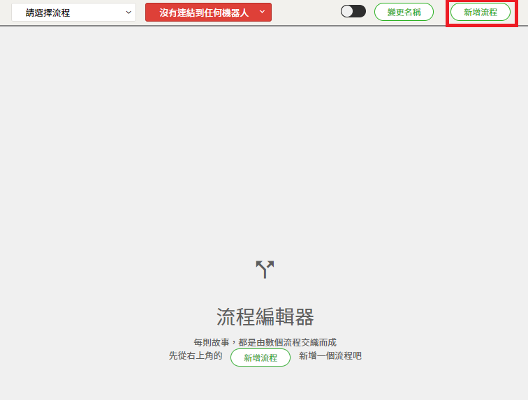

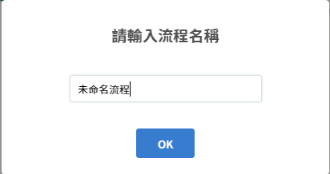

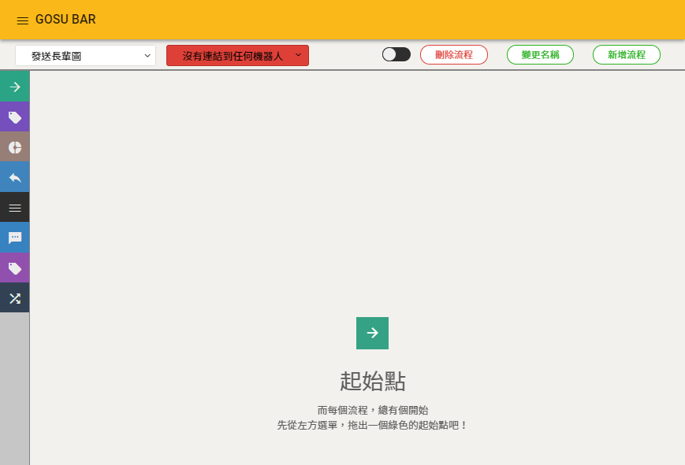

### 4. 設定連接的機器人

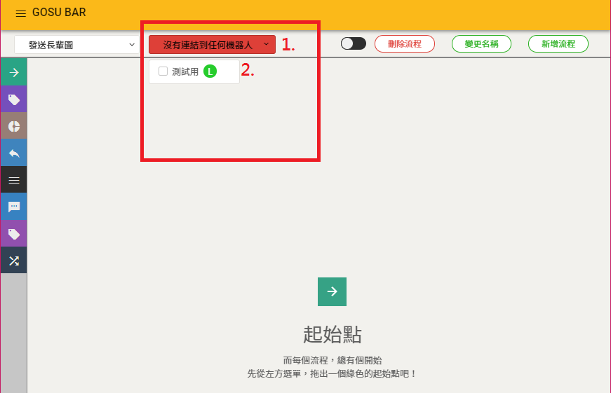


#### 1. 點擊

#### 2. 將需要與此流程連接的機器人打勾


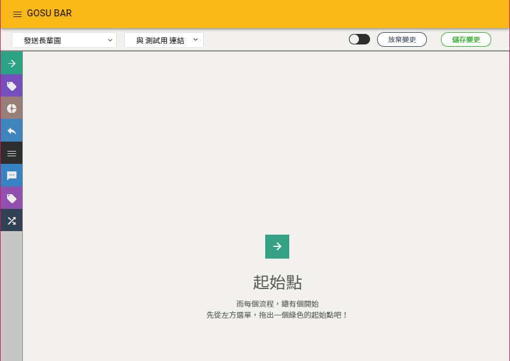

### 5. 儲存變更

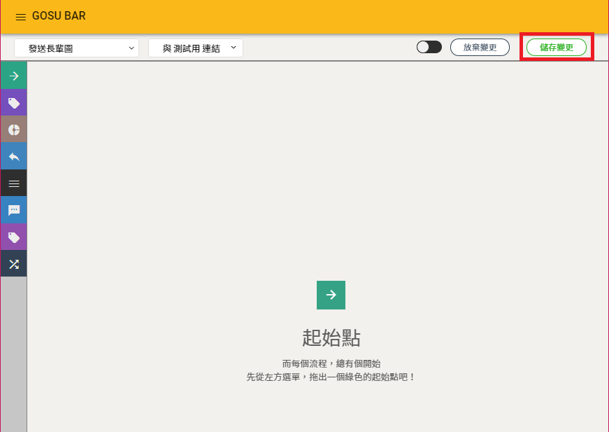


## 定時的按下儲存，是一個良好的習慣


### 6. 新增起始點

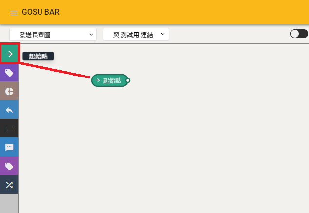

### 7. 起始點 - 設定值

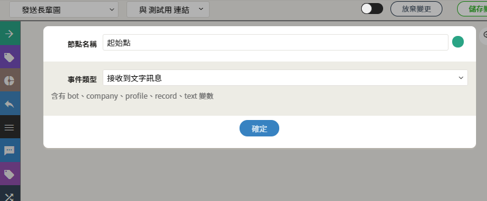

### 8. 新增決策點

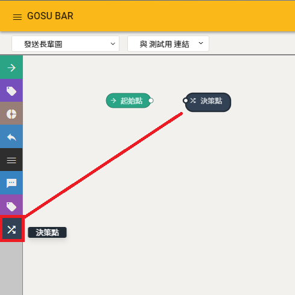

### 9. 決策點 - 設定值

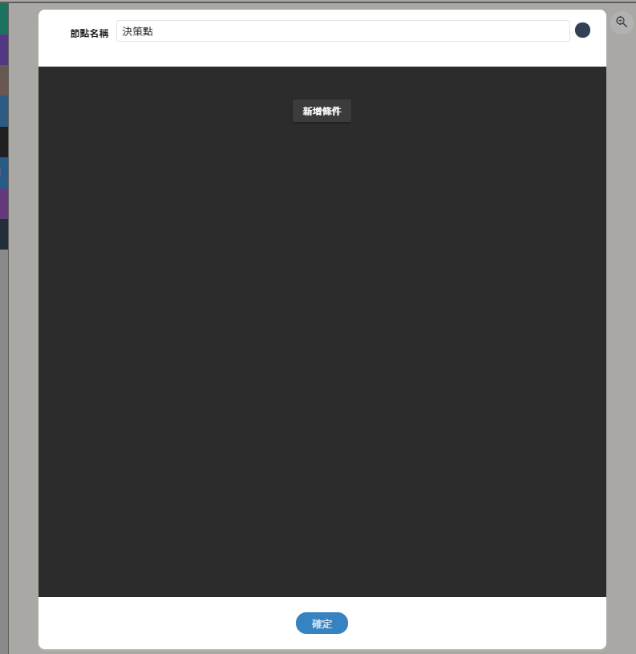

| 列表 | 設定值 |
| :--- | :--- |
| 條件名稱 | 早安 |
| 條件類型 | 文字 |
| 比對的文字 | 早安 |

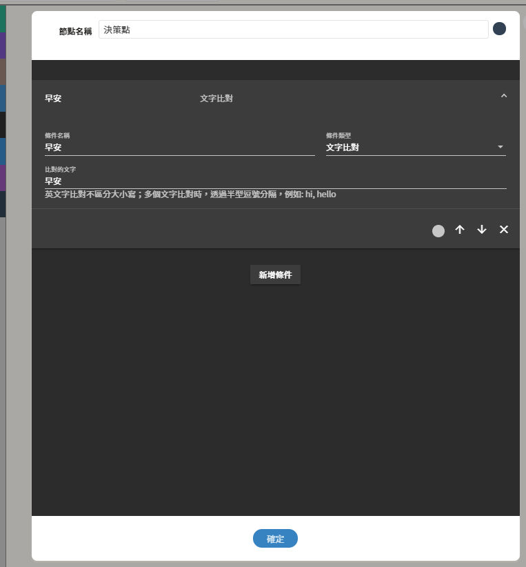

### 10. 新增發送訊息

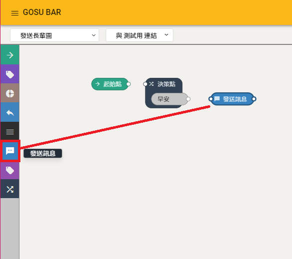

### 11. 發送訊息 - 設定值

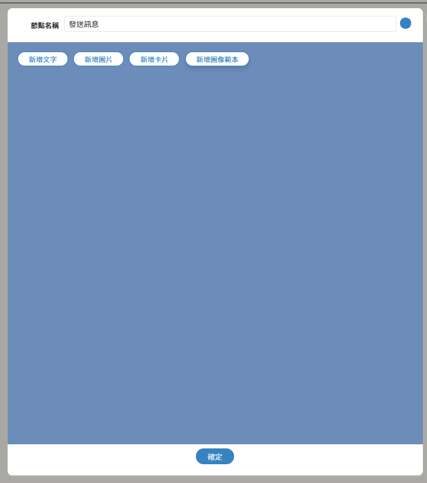

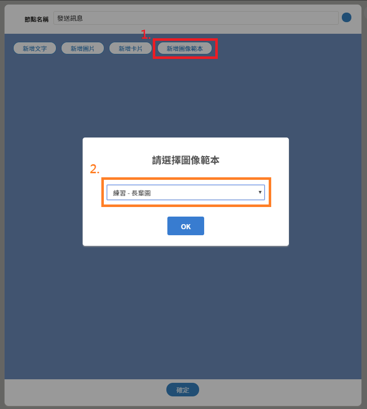


### 1. 點擊 新增圖像範本 按鈕

### 2. 用下拉式選單選擇做好的 長輩圖


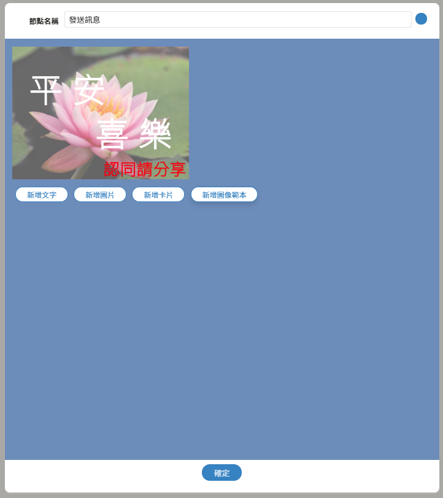

## 連連看

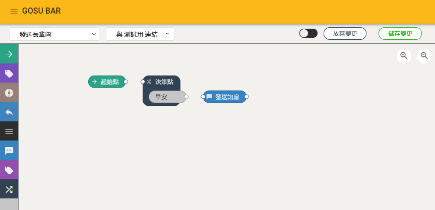

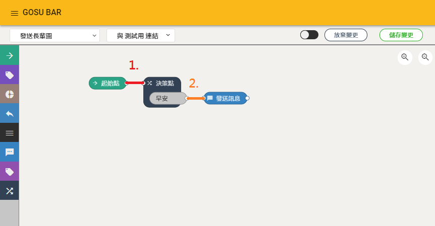

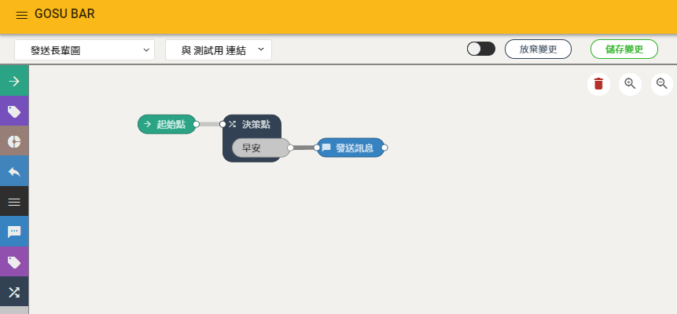

## 儲存變更


### 若發現變更節點設定後 , 沒有看到儲存變更按鈕 , 將隨意節點動一下即可


## 完成作品

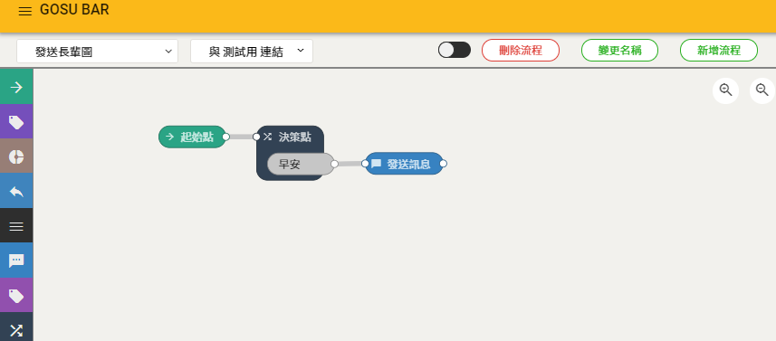

