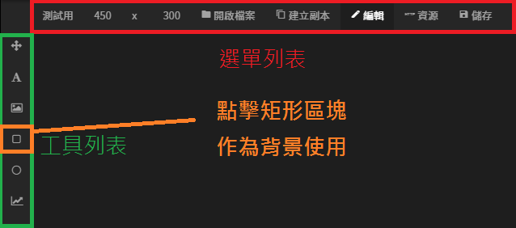

# 圖像編輯器篇

## 進入圖像編輯器

### 1. 開啟選單列表

### 2. 進入圖像編輯器

### 3. 新增海報

### 4. 進入海報

## 底圖設定

### 新增矩形

### 矩形區塊 - 設定值

#### 矩形


**圓角  
預設值：10**


#### 基本屬性

| 列表 | 設定值X |
| :--- | :--- |
| X座標 | 0 |
| Y座標 | 0 |
| 寬度 | 1040 |
| 高度 | 1040 |

## 文字設定

### 新增文字

### 三個文字區塊 - 設定值

#### 文字相關

| 區塊 | 文字內容 | 字體大小 | 粗細 | 水平對齊 | 垂直對齊 |
| :--- | :---: | :---: | :---: | :---: | :---: |
| 標題 | 此圖是否有趣 | 依區塊大小計算字體大小 | 粗體 | 置中對齊 | 置中對齊 |
| 按鈕 1（是） | 是 | 48 | 粗體 | 置中對齊 | 置中對齊 |
| 按鈕 2（否） | 否 | 48 | 粗體 | 置中對齊 | 置中對齊 |


若要手動調整字體大小，需要將 **依區塊大小計算字體大小** 勾選掉，變成 **自訂字體大小**


#### 基本屬性

| 區塊 | x座標 | y座標 | 寬度 | 高度 |
| :--- | :--- | :--- | :--- | :--- |
| 標題 | 0 | 0 | 1040 | 200 |
| 按鈕 1（是） | 100 | 920 | 400 | 100 |
| 按鈕 2（否） | 540 | 920 | 400 | 100 |

#### 點擊行為

| 區塊 | 點擊行為 | 設定值 |
| :--- | :--- | :--- |
| 標題 | 不設定 | 不設定 |
| 按鈕 1（是） | 連結 | [https://www.google.com/](https://www.google.com/) |
| 按鈕 2（否） | 說話 | 不有趣 |


點擊行為  
預設值：無


#### 邊框

| 區塊 | 樣式 | 寬度 | 顏色 |
| :--- | :--- | :--- | :--- |
| 標題 | 實線 | 不設定 | 不設定 |
| 按鈕 1 | 實線 | 5 | \#000000 |
| 按鈕 2 | 實線 | 5 | \#000000 |

## 圖片設定

### 新增圖片

### 圖片區塊 - 設定值

#### 圖片

| 列表 | 設定值 |
| :--- | :--- |
| 圖片網址 | 預設值（黑人問號） |
| 裁切方式 | 符合大小 |

#### 基本屬性

| 列表 | 設定值 |
| :--- | :--- |
| X座標 | 100 |
| Y座標 | 200 |
| 寬度 | 840 |
| 高度 | 700 |

## 儲存設定

