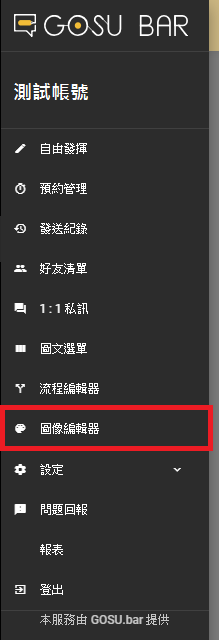

# 圖像編輯器篇

## 進入圖像編輯器

### 1. 開啟選單列表

### 2. 進入圖像編輯器

### 2. 新增圖片

### 3. 進入圖片

## 圖片設定

### 新增圖片

### 圖片區塊 - 設定值

#### 圖片

| 列表 | 設定值 |
| :--- | :--- |
| 圖片網址 | 預設值（黑人問號） |
| 裁切方式 | 符合大小 |

#### 基本屬性

| 列表 | 設定值 |
| :--- | :--- |
| X座標 | 0 |
| Y座標 | 0 |
| 寬度 | 800 |
| 高度 | 600 |

## 儲存內容

