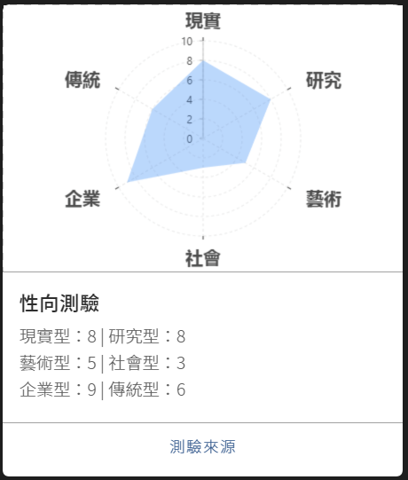
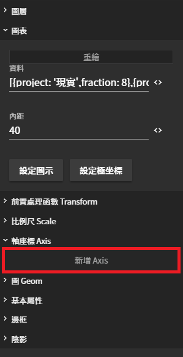
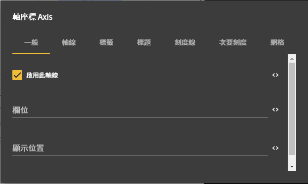

# 性向測驗

## 卡片

## 實作步驟

### 1. 製作數據圖



### 2. 設定回應流程



### 3. 結果



## 優化圖表

### 軸座標 Axis

#### 用來調整軸座標的樣式變化，文字、顏色、間距、......等

### 軸座標 - 設定值

| 列表 | 設定值 |
| :--- | :--- |
| 是否啟用此軸線 | ☑ 啟用 |
| 欄位 | project |
| 軸線 - 顏色 | transparent |
| 標籤 - 文字樣式 - 大小 | 20 |
| 標籤 - 文字樣式 - 粗體 | 粗體 |
| 刻度線 - 顏色 | \#4D4D4D |
| 刻度線 - 長度 | 4 |


此處設定值 , 可以自行調整樣式


### 儲存設定

