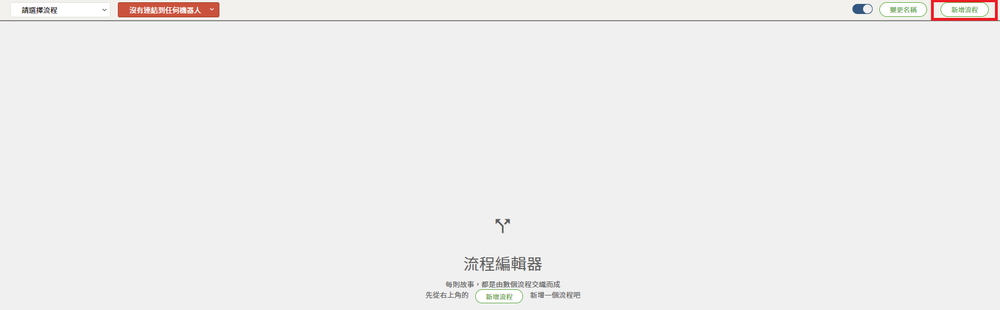
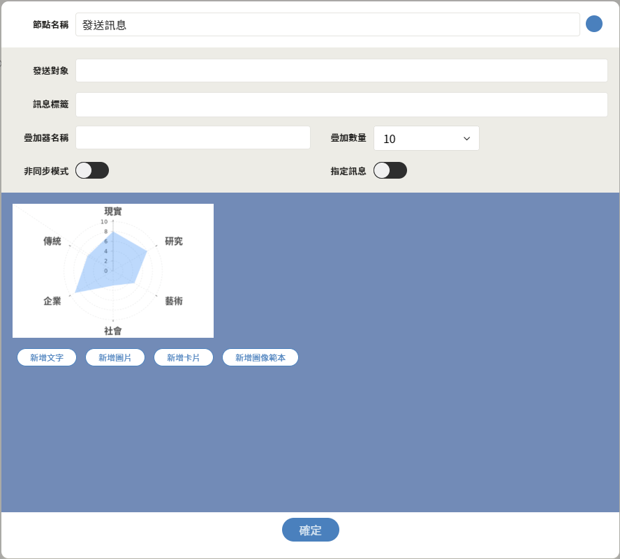

# 流程編輯器篇

## 流程設定

### 1. 開啟選單列表

### 2. 進入流程編輯器

### 

### 3. 新增流程

### 4. 流程與機器人連接

### 5. 儲存流程


## 定時的按下儲存，是一個良好的習慣


## 起始點節點

### 建立起始點

### 起始點 - 設定值

#### 快速點擊兩下進入節點設定內容

## 決策點節點

### 建立決策點

### 決策點 - 設定值

| 列表 | 設定值 |
| :--- | :--- |
| 條件名稱 | 性向測驗 |
| 條件類型 | 文字比對 |
| 比對的文字 | 性向測驗 |

## 發送訊息節點

### 建立發送訊息

### 發送訊息 - 設定值


1. 點擊 新增圖像範本 按鈕

2.  選擇 新建完成的 性向測驗卡片


## 連連看

## 儲存設定

