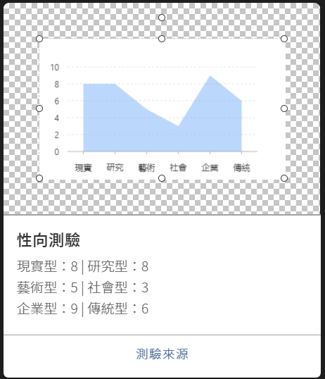

# 圖像編輯器篇

## 進入圖像編輯器

### 1. 開啟選單列表


### 2. 進入圖像編輯器


### 3. 新增卡片


### 4. 進入卡片


## 卡片設定

### 卡片標題

| 列表 | 設定值 |
| :--- | :--- |
| 標題 | 性向測驗 |

### 卡片內文

| 列表 | 設定值 |
| :--- | :--- |
| 內文 | `現實型：8 | 研究型：8 藝術型：5 | 社會型：3 企業型：9 | 傳統型：6` |


此處設定值是依照資料設定


### 替代文字

| 列表 | 設定值 |
| :--- | :--- |
| 替代文字 | 性向測驗 |

## 按鈕設定

### 按鈕1

| 列表 | 設定值 |
| :--- | :--- |
| 類型 | 連結 |
| 按鈕文字 | 測驗來源 |
| 訊息內容 | [`https://www.arealme.com/career/zh/`](https://www.arealme.com/career/zh/) |


## 圖表

### 新增圖表


#### 拖曳出一個圖表區塊


## 圖表區塊 - 設定值

### 資料設定


```javascript
[
{project: '現實',fraction: 8},
{project: '研究',fraction: 8},
{project: '藝術',fraction: 5},
{project: '社會',fraction: 3},
{project: '企業',fraction: 9},
{project: '傳統',fraction: 6}
]

/* 
[
{project: '項目',fraction:'分數'}
]
*/
```

### 內距 - 說明


### 內距 - 設定值


### 上 , 右 , 下 , 左 40, 40, 40, 40

#### 或

### 上右下左 40


## 圖 Geom


### 1. 區域圖 （area）

| 列表 | 設定值 |
| :--- | :--- |
| 欄位 | project\*fraction |
| 類型 | 區域圖（area） |


## 比例尺 Scale


### 比例尺 - 設定值

| 列表 | 設定值 |
| :--- | :--- |
| 欄位 | fraction |
| 類型 | linear |
| 最小值 | 0 |
| 最大值 | 10 |



## 設定極坐標


### 設定極坐標 - 設定值

| 列表 | 設定值 |
| :--- | :--- |
| 類型 | 極坐標系 \(polar\) |


## 基本屬性


### 基本屬性 - 設定值

| 列表 | 設定值 |
| :--- | :--- |
| X座標 | 0 |
| Y座標 | 0 |
| 寬度 | 450 |
| 高度 | 300 |


## 儲存圖片


## [優化說明](https://imaging.gitbook.io/imaging/~/edit/drafts/-LOLfCUlIrxhacuo0_Mg/cheng-jiao/zuo-yi-lei-xing-xiang#hua-biao)



### [點我](https://imaging.gitbook.io/imaging/~/edit/drafts/-LOLfCUlIrxhacuo0_Mg/cheng-jiao/zuo-yi-lei-xing-xiang#hua-biao) 進入優化說明

