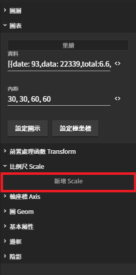

# 慢性病盛行率

## 海報

#### 96年 20歲以上慢性病盛行率

## 實作步驟

### 1. 製作數據圖



### 2. 設定回應流程



### 3. 結果



## 優化圖表

### 比例尺 Scale

#### 用來調整軸座標顯示的格式

| 列表 | 設定值 |
| :--- | :--- |
| 欄位 | prevalenceRate |
| 類型 | linear |
| 刻度間距 | 2.5 |
| 最大值 | 25 |
| 格式化函數 | `function(row) { return row + '%'; }` |

### 設定圖示

#### 用來呈現圖表內容的輔助圖示

| 列表 | 設定值 |
| :--- | :--- |
| 是否啟用 | ☑ 啟用 |
| 欄位 | project |
| 位置 | 下 |
| 排版 | 水平  |
| 文字樣式 - 對齊 | 置左 |
| 文字樣式 - 大小 | 30 |
| 文字樣式 - 粗體 | 粗體 |

### 儲存設定

