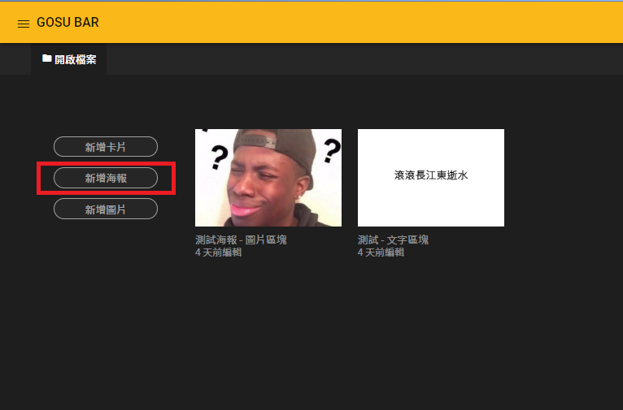
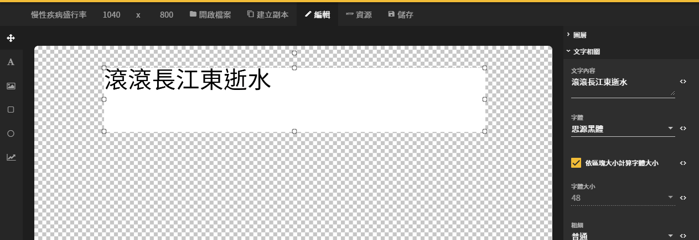
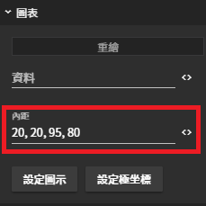
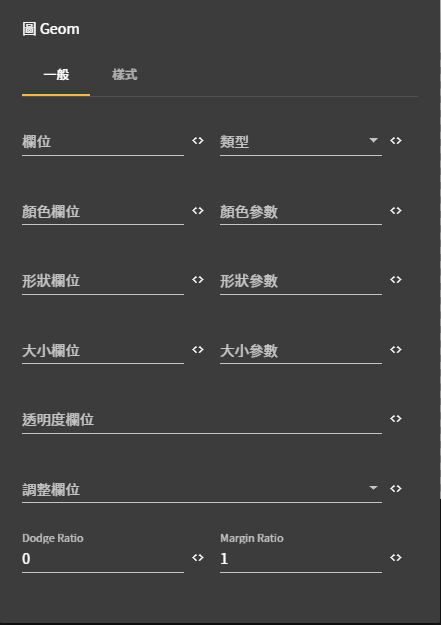
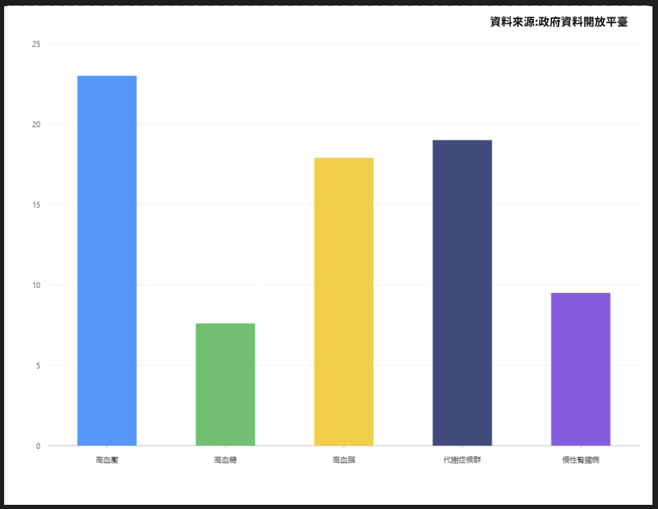

# 圖像編輯器篇

## 進入圖像編輯器

### 1. 開啟選單列表


### 2. 進入圖像編輯器


### 3. 新增海報



### 4. 進入海報


## 調整圖片高度



### 1. 點擊 修改高度 （海報寬度固定1040無法變更）

### 2. 高度設定 800 


## 資料來源文字設定

### 新增文字


#### 拖曳出一個文字區塊



### 文字區塊 - 設定值

#### 文字相關

| 列表 | 設定值 |
| :--- | :--- |
| 文字內容 | 資料來源:政府資料開放平臺 |
| 是否自動調整字體大小 | ☐ 自訂字體大小 |
| 字體大小 | 18 |
| 粗細 | 粗體 |
| 水平對齊 | 置中對齊 |
| 垂直對齊 | 置中對齊 |

#### 基本屬性

| 列表 | 設定值 |
| :--- | :--- |
| X座標 | 740 |
| Y座標 | 0 |
| 寬度 | 300 |
| 高度 | 50 |

#### 點擊行為

| 列表 | 設定值 |
| :--- | :--- |
| 點擊行為 | 連結 |
| 連結網址 | [https://data.gov.tw/dataset/8838](https://data.gov.tw/dataset/8838) |


## 圖表

### 新增圖表


#### 拖曳出一個圖表區塊


## 圖表 - 設定值

### 資料設定


```javascript
[
{project:'高血壓', prevalenceRate: 23.0},
{project:'高血糖', prevalenceRate: 7.6},
{project:'高血脂', prevalenceRate: 17.9},
{project:'代謝症候群', prevalenceRate: 19.0},
{project:'慢性腎臟病', prevalenceRate: 9.5}
]

/*
96年20歲以上慢性病盛行率
[{project: 項目, prevalenceRate: 盛行率(%)}]
*/
資料來源:政府資料開放平台
https://data.gov.tw/dataset/8838
```


### 內距 - 說明




### 內距 - 設定值


## 上, 右 , 下, 左 60, 20, 95, 70


## 圖 Geom

### 1. 柱狀圖（interval）

#### 新增 Geom




#### 設定值

| 列表 | 設定值 |
| :--- | :--- |
| 欄位 | project\*prevalenceRate |
| 類型 | 柱狀圖 \(interval\) |
| 顏色欄位 | project |

#### 重繪


## 基本屬性


### 基本屬性 - 設定值

| 列表 | 設定值 |
| :--- | :--- |
| X座標 | 0 |
| Y座標 | 0 |
| 寬度 | 1040 |
| 高度 | 800 |

## 圖層順序（注意圖層）




## 儲存變更


## [優化說明](https://imaging.gitbook.io/imaging/~/edit/drafts/-LOGQpUpTGO13MPSLT9f/cheng-jiao/zuo-yi-zhu-man-xing-bing-sheng-hang-lv#hua-biao)



#### [點我](https://imaging.gitbook.io/imaging/~/edit/drafts/-LOGQpUpTGO13MPSLT9f/cheng-jiao/zuo-yi-zhu-man-xing-bing-sheng-hang-lv#hua-biao) 進入優化說明

