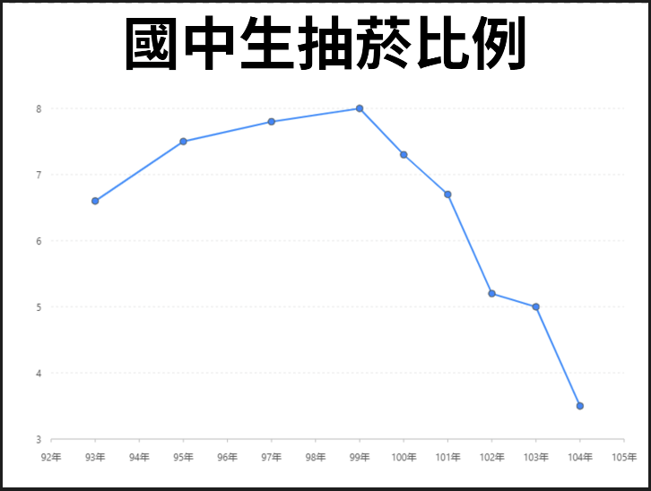

# 國中生抽菸比例

## 圖片

## 實作步驟

### 1. 製作數據圖



### 2. 設定回應流程



### 3. 結果



## 優化圖表

## 比例尺 Scale 

#### 用來調整軸座標顯示的格式

### X軸（time）- 設定值

| 列表 | 設定值 |
| :--- | :--- |
| 欄位 | date |
| 類型 | linear |
| 刻度間距 | 1 |
| 最小值 | 92 |
| 最大值 | 105 |
| 格式化函數 | `function(row) {  return row + '年'; }` |

### Y軸（total）- 設定值

| 列表 | 設定值 |
| :--- | :--- |
| 欄位 | total |
| 類型 | linear |
| 刻度間距 | 1 |
| 最小值 | 0 |
| 最大值 | 10 |
| 格式化函數 | `function(row) {  return row + '%'; }` |

### 儲存設定

