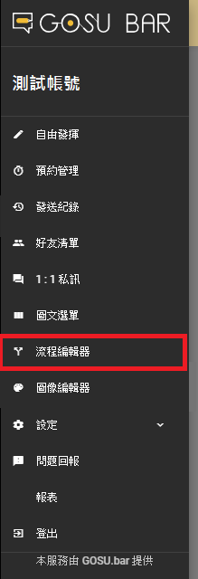
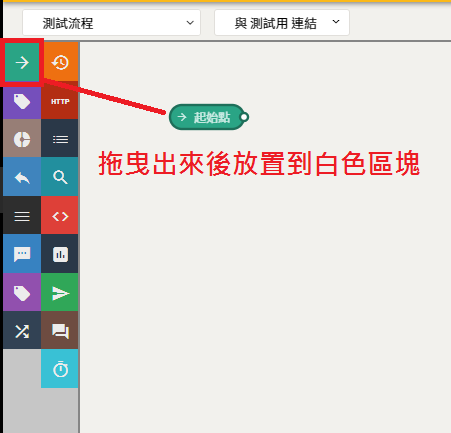
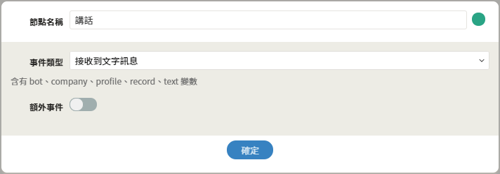

# 流程編輯器篇

## 流程設定

### 1. 開啟選單列表

### 2. 進入流程編輯器

### 3. 新增流程

### 4. 流程與機器人連接

### 5. 儲存流程


## 定時的按下儲存，是一個良好的習慣


## 起始值設定

### 建立起始點

### 起始點 - 設定值

#### 快速點擊兩下進入節點設定內容

## 決策點設定

### 建立決策點

### 決策點 - 設定值

| 列表 | 設定值 |
| :--- | :--- |
| 條件名稱 | 測試訊息 |
| 條件類型 | 文字比對 |
| 比對的文字 | 數據查看 |


比對的文字可自行調整與修正


## 建立發送節點

### 發送節點 - 教學說明

### 發送訊息 - 設定值

## 連連看

## 儲存變更

