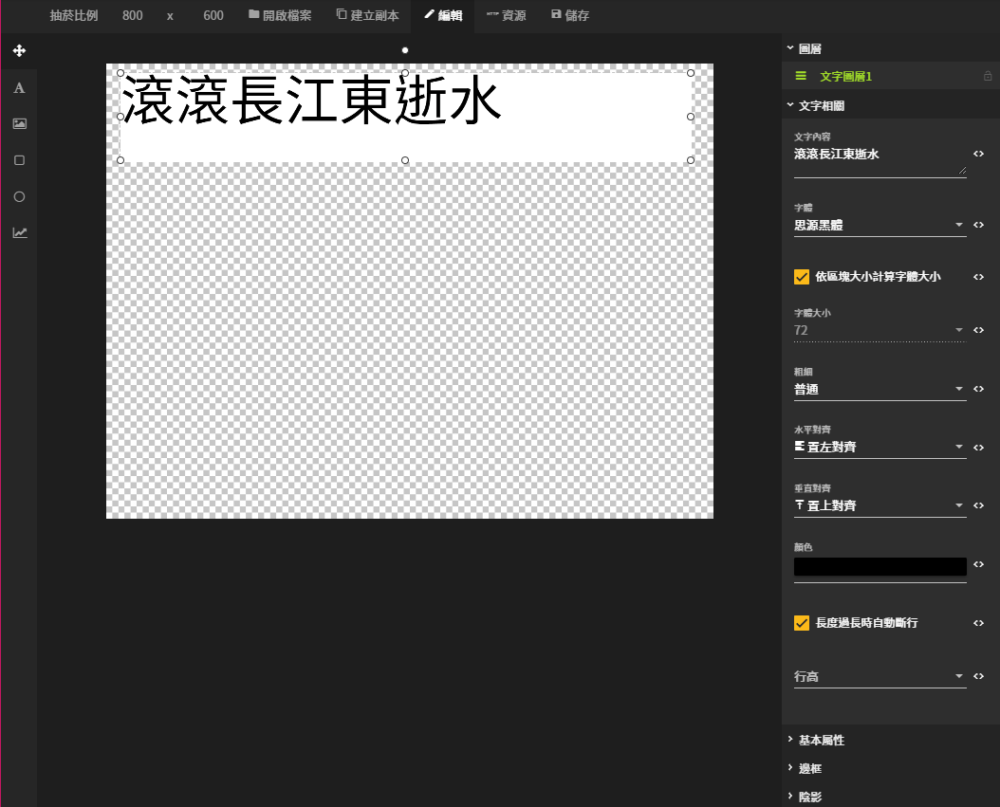
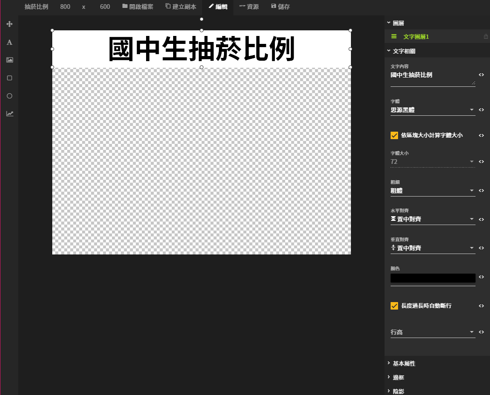
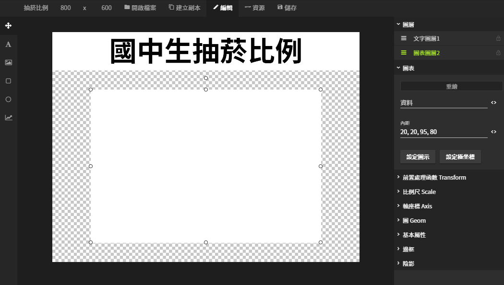
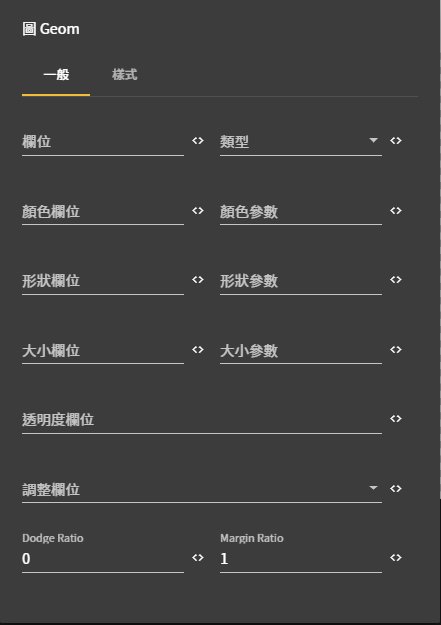
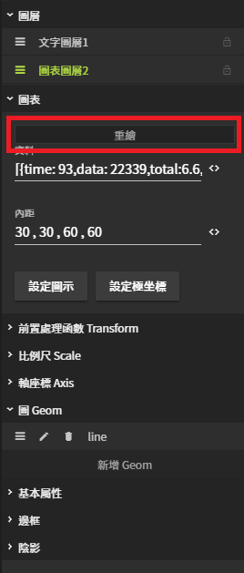
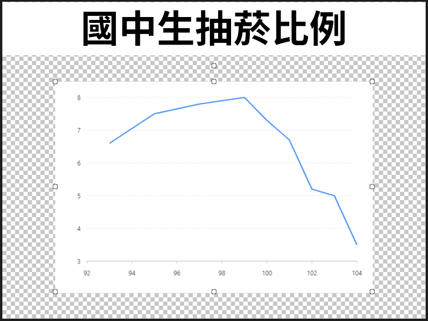
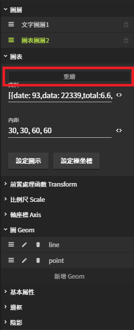
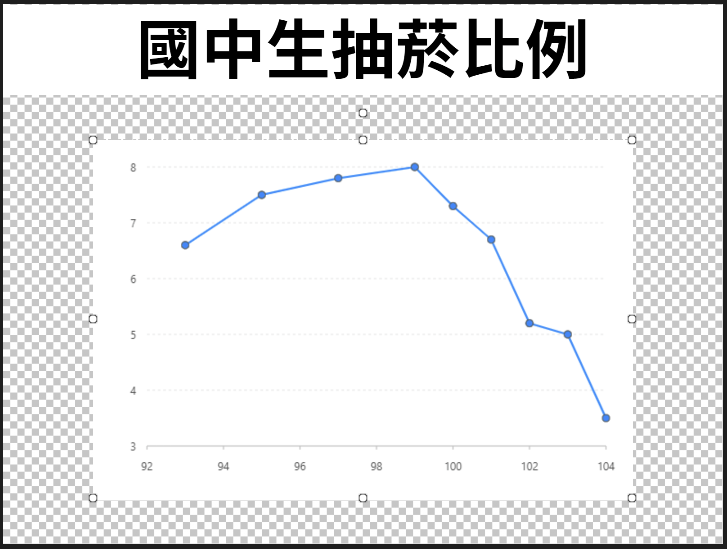
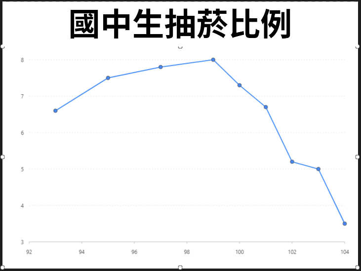
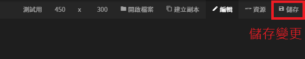

# 圖像編輯器篇

## 進入圖像編輯器

### 1. 開啟選單列表


### 2. 進入圖像編輯器


### 3. 建立圖片


### 4. 進入圖片


## 標題設定

### 建立矩形區塊


#### 拖曳出文字區塊



### 矩形區塊 - 設定值



#### 文字相關

| 列表 | 設定值 |
| :--- | :--- |
| 文字內容 | 國中生抽菸比例 |
| 粗細 | 粗體 |
| 水平對齊 | 置中對齊 |
| 垂直對齊 | 置中對齊 |

#### 基本屬性

| 列表 | 設定值 |
| :--- | :--- |
| X座標 | 0 |
| Y座標 | 0 |
| 寬度 | 800 |
| 高度 | 100 |

## 圖表設定

### 建立圖表區塊


#### 拖曳出一個圖表區塊



## 圖表區塊 - 設定值

### 資料設定


```javascript
[
{ time: 93, data: 22339, total:6.6, male: 8.5, female: 4.2},
{ time: 95, data: 22393, total:7.5, male: 9.7, female: 4.7},
{ time: 97, data: 21678, total:7.8, male: 10.3, female: 4.9},
{ time: 99, data: 21282, total:8, male: 11.2, female: 4.2},
{ time: 100, data: 13408, total:7.3, male: 10.5, female: 3.7},
{ time: 101, data: 12987, total:6.7, male: 9.3, female: 3.7},
{ time: 102, data: 13559, total:5.2, male: 7.5, female: 2.6},
{ time: 103, data: 21753, total:5, male: 6.4, female: 3.5},
{ time: 104, data: 21735, total:3.5, male: 4.9, female: 2}
]
/*
國中生抽菸比例
{time: 時間, data: 有效樣本數, total: 合計(%), male: 男性(%), female: 女性(%)}
*/
資料來源:政府資料開放平台
https://data.gov.tw/dataset/9340
```

### 內距 - 說明


### 內距 - 設定值


## 上 , 右  , 下 , 左 30 , 30 , 60 , 60


## 圖 Geom

### 1. 線圖

#### 新增Geom（line）


#### 設定值



| 列表 | 設定值 |
| :--- | :--- |
| 欄位 | time\*total |
| 類型 \(下拉式選單\) | 線圖（line） |

#### 重繪





### 2. 點圖

#### 新增Geom（point）


設定值

| 列表 | 設定值 |
| :--- | :--- |
| 欄位 | time\*total |
| 類型（下拉式選單） | 點凸（point） |
| 形狀參數 | circle |
| 大小參數 | 4 |
| 樣式 - 顏色 | \#666666 |
| 樣式 - 透明度 | 1 |
| 樣式 - 寬度 | 1 |

#### 重繪





## 基本屬性

| 列表 | 設定值 |
| :--- | :--- |
| X座標 | 0 |
| Y座標 | 100 |
| 寬度 | 800 |
| 高度 | 500 |



## 儲存設定



## [優化說明](https://imaging.gitbook.io/imaging/~/edit/drafts/-LOGQpUpTGO13MPSLT9f/cheng-jiao/zuo-yi#hua-biao)



#### [點我](https://imaging.gitbook.io/imaging/~/edit/drafts/-LOGQpUpTGO13MPSLT9f/cheng-jiao/zuo-yi#hua-biao) 進入優化說明


