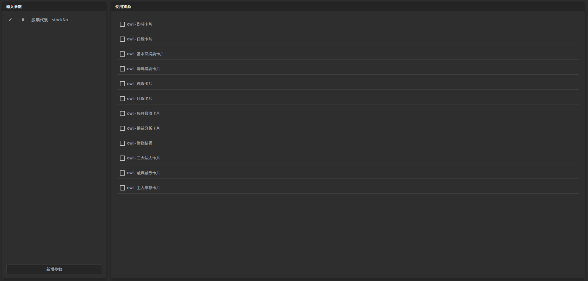

# 進階設定說明（規劃中）

### 圖片預覽



### 宣告參數

#### 新增參數

1. key（ 識別碼，由英文或數字組成，開頭必須英文 ） 例如：Example1 
2. 中文（ 中文說明 ） 例如：例子1 
3. 預設值（ 若沒有給值，則套用預設值 ） 例如： 我是預設值

#### 引入參數

```javascript
${prop.key}
```

#### 範例

```javascript
${prop.Example1}
```


#### function用法

```javascript
${
function(){
let text = prop.Example1;
text += '1';
return text;
}()
}
```


### API 資料源設定

可跟著資料源數據變更自動來做調整




### 範例說明

以股票來呈現



