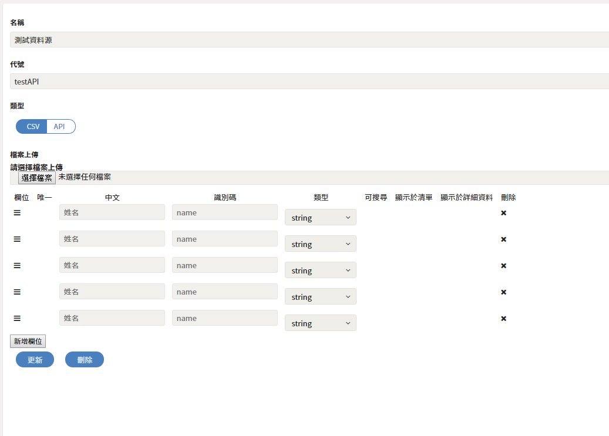

# CSV

### 圖片預覽

### 檔案上傳

* CSV檔名

### CSV格式

<table>
  <thead>
    <tr>
      <th style="text-align:left">&#x5217;&#x8868;</th>
      <th style="text-align:left">&#x529F;&#x80FD;&#x8AAA;&#x660E;</th>
    </tr>
  </thead>
  <tbody>
    <tr>
      <td style="text-align:left">&#x6B04;&#x4F4D;</td>
      <td style="text-align:left">&#x62D6;&#x66F3;&#x53EF;&#x4EE5;&#x5C0D;&#x8ABF;&#x9806;&#x5E8F;</td>
    </tr>
    <tr>
      <td style="text-align:left">&#x552F;&#x4E00;</td>
      <td style="text-align:left">&#x8CC7;&#x6599;&#x662F;&#x5426;&#x552F;&#x4E00;&#x6027;</td>
    </tr>
    <tr>
      <td style="text-align:left">&#x4E2D;&#x6587;</td>
      <td style="text-align:left">&#x6B04;&#x4F4D;&#x540D;&#x7A31;</td>
    </tr>
    <tr>
      <td style="text-align:left">&#x8B58;&#x5225;&#x78BC;</td>
      <td style="text-align:left">&#x6B04;&#x4F4D;keyWord</td>
    </tr>
    <tr>
      <td style="text-align:left">&#x985E;&#x578B;</td>
      <td style="text-align:left">
        
&#x8CC7;&#x6599;&#x985E;&#x578B;

        
<code>String</code>
        

        
<code>Text</code>
        

        
<code>Number</code>
        

        
<code>Boolean</code>
        

        
<code>Array</code>
        

        
<code>Date</code>
        

      </td>
    </tr>
    <tr>
      <td style="text-align:left">&#x53EF;&#x641C;&#x5C0B;</td>
      <td style="text-align:left">&#x662F;&#x5426;&#x53EF;&#x4EE5;&#x6B04;&#x4F4D;&#x641C;&#x5C0B;&#x904E;&#x6FFE;
         EX&#xFF1A;&#x6B64;&#x6B04;&#x4F4D;&#x662F;&#x5426;&#x6709;&#x59D3;&#x9673;&#x7684;</td>
    </tr>
    <tr>
      <td style="text-align:left">&#x986F;&#x793A;&#x65BC;&#x6E05;&#x55AE;</td>
      <td style="text-align:left">&#x6709;API&#xFF08;List&#xFF09;&#x53EF;&#x6293;&#x5230;</td>
    </tr>
    <tr>
      <td style="text-align:left">&#x986F;&#x793A;&#x65BC;&#x8A73;&#x7D30;&#x8CC7;&#x8A0A;</td>
      <td style="text-align:left">&#x6709;API&#x53EF;&#x6293;&#x5230;</td>
    </tr>
    <tr>
      <td style="text-align:left">&#x522A;&#x9664;</td>
      <td style="text-align:left">&#x522A;&#x9664;&#x6B64;&#x7B46;&#x8CC7;&#x6599;</td>
    </tr>
  </tbody>
</table>

