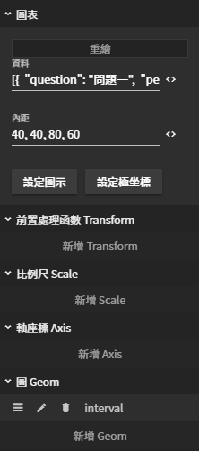

# 圖表

## 圖片預覽

## 設定值

### 圖表

* **重繪** （將設定值重新繪製上圖表區塊） 
* **資料** （圖表的資料源） 
* **內距** （邊與內容的距離）
  * 上 , 右 , 下 , 左（例如： 40 , 40 , 80 , 60 ）
  * 上 , 左 右 , 下（ 例如：40 , 60 , 80 ）
  * 上下 , 左右（例如： 80 , 60 ）
  * 上右下左（ 例如：50 ） 
* **設定圖示** （圖表標示）



* **設定極座標** （設定圖表顯示的方式，預設值：直角坐標系）
  * 直角坐標系（例如：折線圖、柱狀圖）
  * 極坐標系（例如：雷達圖、玫瑰圖）
  * 圓餅圖
  * 螺旋坐標系



* **前置處理函數 Transform** （資料整理、加工、過濾、.......等等）



* **比例尺 Scale** （設定比例尺的刻度內容與刻度格式）



* **軸座標 Axis** （比例尺樣式與輔助線樣式）



* **圖 Geom** （圖表內容）



