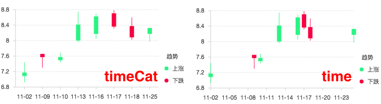

# 比例尺 Scale 詳細說明

## 圖片預覽

## 比例尺 Scale - 設定值

* **欄位** （填入欄位值來做比例尺設定）
* **類型**

| 類型 | 說明 | 舉例 |
| :--- | :--- | :--- |
| linear |  連續的數值 |  \[1 ,2 ,3 ,4 ,5\] |
| log |  連續非線性的Log數據 |  將 \[1,10,100,1000\] 轉換成 \[0,1,2,3\] |
| power |  連續非線性的pow數據 |  將 \[2,4,8,16,32\] 轉換成 \[1,2,3,4,5\] |
| cat |  分類 |  \[ '男' , '女' \] |
| time |  連續的時間類型 |  股票時間 |
| timeCat |  非連續的時間 |  股票時間 |

* **範圍**（ 與起始點的間距，資料顯示的長度\(後-前\)） ****（範圍0 ~ 1 ，格式： 0,1 ，舉例：0.2~0.8）
* **別名**

  （該數據字段的顯示別名，一般用於將字段的英文名稱轉換成中文名）

* **刻度值**（ 刻度數量、刻度間距、刻度內容 **三擇一設定**，若設定到兩項以**下方的項目為主**）
  * 刻度數量 （幾個刻度數量，輸入後會自動優化數量）
  * 刻度間距 （刻度與刻度之間的距離,若**類型為 time 和 timeCat 以秒為單位**，例如：86400）
  * 刻度內容 （直接設定刻度內容）
* **優化數據範圍** （☑ 優化數據範圍，☐ 不優化 ）
* **最小值** （比例尺的最小值）
* **最大值** （比例尺的最大值）
* **log基數**
* **指數**
* **分類值 （ cat 限定）**
* **時間格式（ time 和 timeCat 限定）**
  * YYYY （西元年分）
  * MM （月份 , 01 ~ 12，4個M = 英文全稱 , 3個M = 英文縮寫）
  * DD （日期 ,01 ~ 31 ）
  * ddd （星期 , 一 ~ 七，4個d = 英文全稱 , 3個d = 英文縮寫）
  * HH （小時 , 0 ~ 24）
  * mm （分鐘 , 0 ~ 59）
  * ss （秒鐘 , 0 ~ 59）
  * sss （毫秒 , 0 ~ 999）  範例：YYYY-MM-DD\(ddd\) 結果：2018-01-01\(MON\)
* **格式化函數** （程式化比例尺上的數值，例如：千分位）



