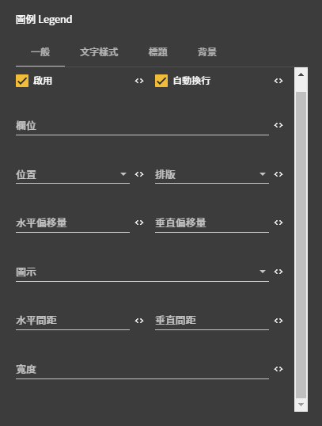

# 設定圖示 Legend 詳細說明

## 圖片預覽

## 圖例 Legend - 設定值

### 一般

* **啟用** （ ☑ 啟用圖示，☐ 不啟用圖示 ） 
* **自動換行** （ ☑ 自動換行，☐ 不自動換行 ） 
* **欄位** （ 以此資料欄位來做圖示標準 ，必填欄位 ） 
* **位置**（圖示呈現在圖表的哪一個位置）
  * 上
  * 左
  * 右
  * 下 
* **排版**
  * 垂直 （圖示以垂直呈現）
  * 水平 （圖示以水平呈現） 
* **水平偏移量**
  * 往右偏移為 正
  * 往左偏移為 負
  * 例如： 30（ 往右偏移 30px ） 
* **垂直偏移量**
  * 往下偏移為 正
  * 往上偏移為 負
  * 例如： -30 （ 往上偏移 30px ） 
* **圖示** （顯示圖示的樣式）
* **水平間距** （圖示左右間距）
* **垂直間距** （圖示上下間距）
* **寬度** （圖示寬度）

### 文字樣式

* **對齊**
  * 置左
  * 置中
  * 置右
* **顏色**（字體顏色）
* **大小**（字體大小）
* **粗體**（字體粗細）
  * 一般
  * 粗體
* **旋轉**（旋轉角度）
* **基準線**
  * 上
  * 中
  * 下

### 標題

* **啟用** （ ☑ 啟用，☐ 不啟用）
* **對齊**
  * 置左
  * 置中
  * 置右
* **顏色**（字體顏色）
* **大小**（字體大小）
* **粗體**（字體粗細）
  * 一般
  * 粗體
* **旋轉**（旋轉角度）
* **基準線**
  * 上
  * 中
  * 下

### 背景

* **填滿顏色** （背景顏色）
* **透明度** （背景透明度）
* **邊框顏色** （邊框顏色）
* **邊框透明度** （邊框透明度）
* **邊框粗細** （邊框粗細寬度）
* **圓角大小**
* **整體透明度**



