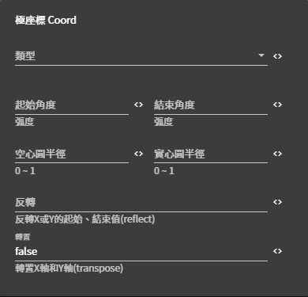

# 設定極座標 Coord 詳細說明

## 圖片預覽

### 設定極座標 Coord - 設定值

* **類型**
  * 直角坐標系（例如：折線圖、柱狀圖）
  * 極坐標系（例如：雷達圖、玫瑰圖）
  * 圓餅圖
  * 螺旋坐標系
* **起始角度** 
* **結束角度**
* **空心圓半徑（ 設定值 0 ~ 1 ）**
* **實心圓半徑（ 設定值 0 ~ 1 ）**
* **反轉（ 反轉X 或 Y 的起始、結束值reflect ）**
  * X
  * Y
* **轉置（ 轉置X軸和Y軸 ，預設值 false ）**
  * false
  * true



