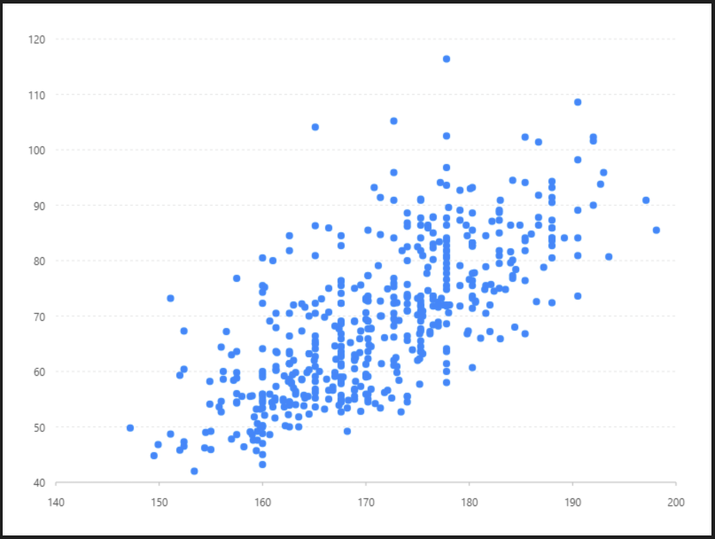
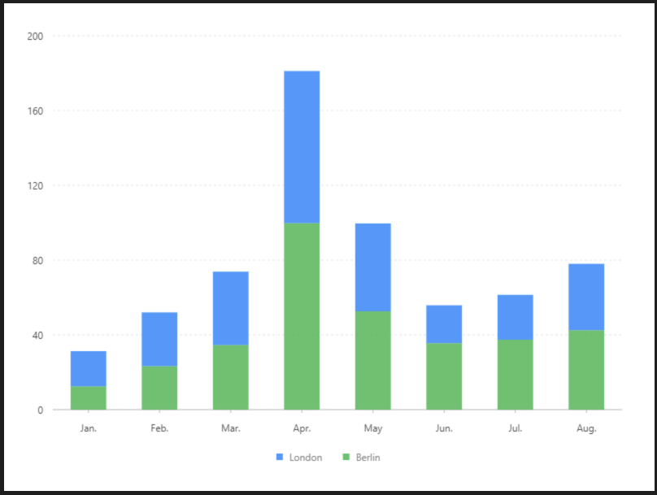
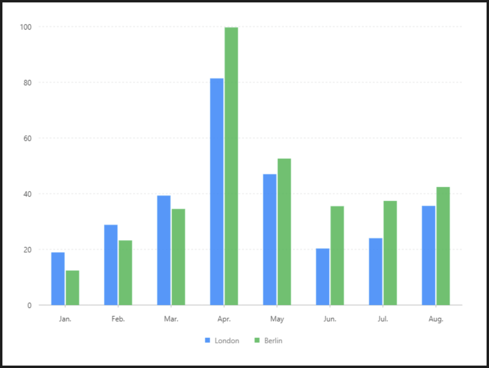
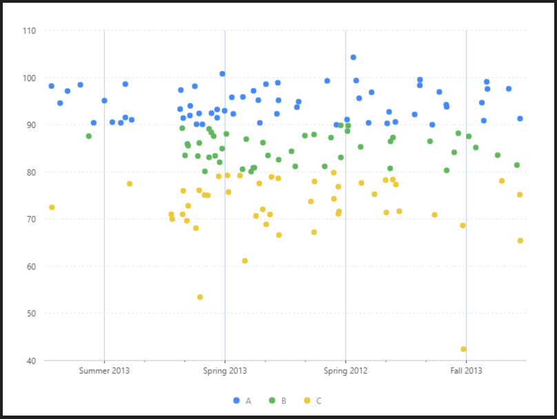

# 圖 Geom 詳細說明

## 圖片預覽

## 圖 Geom - 設定值

* **欄位**
  * 填入的數值來做繪圖
  * 一個值, 大多用來繪製圓餅圖
  * 兩個值, X軸與Y軸類型的圖表
  * 三個以上, 多邊形圖表
  * 例如：number\*name 
* **類型**

<table>
  <thead>
    <tr>
      <th style="text-align:left">&#x985E;&#x578B;</th>
      <th style="text-align:center">&#x8AAA;&#x660E;</th>
    </tr>
  </thead>
  <tbody>
    <tr>
      <td style="text-align:left">&#x9EDE;&#x5716;</td>
      <td style="text-align:center">
        
      </td>
    </tr>
    <tr>
      <td style="text-align:left">&#x8DEF;&#x5F91;&#x5716;</td>
      <td style="text-align:center">
        

          
        

        
&#x96D9;&#x5411;&#x7E6A;&#x51FA;&#xFF0C;&#x5DE6;&#x53F3;&#x4F86;&#x56DE;&#x7686;&#x53EF;

      </td>
    </tr>
    <tr>
      <td style="text-align:left">&#x7DDA;&#x5716;</td>
      <td style="text-align:center">
        

          
        

        
&#x55AE;&#x5411;&#x7E6A;&#x51FA;&#xFF0C;&#x5F9E;&#x5DE6;&#x81F3;&#x53F3;&#x7E6A;&#x51FA;

      </td>
    </tr>
    <tr>
      <td style="text-align:left">&#x5340;&#x57DF;&#x5716;</td>
      <td style="text-align:center">
        
      </td>
    </tr>
    <tr>
      <td style="text-align:left">&#x591A;&#x908A;&#x5F62;</td>
      <td style="text-align:center">
        
      </td>
    </tr>
    <tr>
      <td style="text-align:left">K&#x7DDA;&#x5716;</td>
      <td style="text-align:center">
        
      </td>
    </tr>
    <tr>
      <td style="text-align:left">&#x6A39;&#x72C0;&#x5716;</td>
      <td style="text-align:center">
        
      </td>
    </tr>
    <tr>
      <td style="text-align:left">&#x71B1;&#x529B;&#x5716;</td>
      <td style="text-align:center">
        

          
        

        
&#x76EE;&#x524D;&#x53EF;&#x7E6A;&#x51FA;&#xFF0C;&#x4F46;&#x7121;&#x6CD5;&#x50B3;&#x9001;&#xFF08;&#xFF22;&#xFF35;&#xFF27;&#xFF09;

      </td>
    </tr>
  </tbody>
</table>* **顏色**（圖表內容的顏色）

  * 顏色欄位 （可填入變數，來做顏色區分）
  * 顏色參數 `填入色碼， 若多個顏色變數皆可調整， 若為空有預設值 例如：#333333,#000000,#ffffff` 

* **形狀**
  * 形狀欄位 \(可填入變數，來做形狀區分\)
  * 形狀參數 `填入下方樣式參數， 若多個形狀變數皆可調整， 若為空有預設值 例如：circle,square,diamond`    

* **大小**
  * 大小欄位 （可填入變數，來做大小區分）
  * 大小參數

    `填入數字，  
    若多個變數值皆可調整，  
    若為空有預設值  
    例如：2,3,5` 
* **透明度**（BUG）
  * 透明度欄位

    （可填入變數，來做透明度區分）

  * 透明度參數

    `填入0 ~ 1，  
    若透明度欄位為空,不會有預設值  
    若多個變數值皆可調整，為空有預設值  
    例如：0.2,0.6,0.8` 

  
* **調整欄位**（圖表呈現類型） 
  * **堆疊**    
  * **分組**    
  * **擾動**    
  * **對稱**    
* **DodgeRatio**（調整欄位 - 分組專用）
  * 用來調整分組各柱是否重疊
  * 與 MarginRatio 相互影響
  * 若為0 會疊再一起
  * 若為空值，有預設值
* **MarginRatio**（調整欄位 - 分組專用）
  * 用來調整分組各柱之間的間距
  * 範圍值：0 ~ 1
  * 若為空值，有預設值



