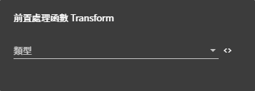

# 前置處理函數 Transform 詳細說明

## 圖片預覽

## 前置處理函數 Transform - 設定值

### **類型**

* **數據過濾**
* **數據加工**
* **字串過濾**
* **字串重新命名**
* **逆序排列**
* **數據排序**
* **按字串排序**
* **獲取子集**
* **數據分組**
* **補全行**
* **補全列、字串**
* **字串展開**



