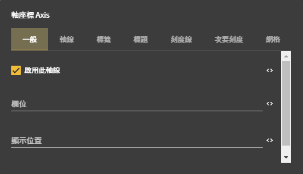

# 軸座標 Axis 詳細說明

## 圖片預覽

## 軸座標 Axis - 設定值

### 一般

* 啟用此軸線 （☑ 開啟軸線，☐ 隱藏軸線，所有效果都會隱藏掉）
* 欄位 （以哪個欄位作為軸座標基準值）
* 顯示位置
  * left
  * right
  * top
  * bottom

### 軸線

* **顏色** （軸座標線的顏色）
* **透明度** （軸座標線的透明度）
* **虛線間距** （虛線的間距若不填為**實線**，例如 3 ,  2 , 1 ）
* **寬度** （軸線的寬度）

### 標籤

* 與軸線間距 （文字與軸座標的間距）
* 格式化輸出函數 （將標籤的顯示的樣式程式化）
* 自動旋轉

  （☑ 軸座標內容過多會自動傾斜呈現，3點鐘方向為0度，☐ 一律水平呈現）

* 文字樣式
  * 對齊
    * 置左
    * 置中
    * 置右
  * 顏色 （文字顏色）
  * 大小 \(文字大小\)
  * 粗體
    * 一般（預設值）
    * 粗體
  * 旋轉 （旋轉角度，若有自動旋轉，會再加上自動旋轉的角度）
  * 基準線 
    * 上
    * 中
    * 下

### 標題

* 位置
* 間距
* 自動旋轉
* 文字樣式
  * 對齊
  * 顏色
  * 大小
  * 粗體
  * 旋轉
  * 基準線

### 刻度線

* **顏色** （刻度線的顏色）
* **透明度** （刻度線的透明度）
* **寬度** （刻度線的寬度）
* **長度** （刻度線的長度）

### 次要刻度線 

（刻度與刻度中間的小刻度為次要刻度線，若值為空則不顯示）

* **數量** （次刻度的數量）
* **顏色** （次刻度的顏色）
* **透明度** （次刻度的透明度）
* **寬度** （次刻度的寬度）
* **長度** （次刻度的長度）

### 網格

* **類型**
  * **線**（線條樣式）
    * 顏色
    * 透明度
    * 虛線間距
    * 寬度
  * **矩形**
    * 矩形顏色
* **隱藏第一行** （☑ 隱藏，☐ 不隱藏）
* **隱藏最後一行** （☑ 隱藏，☐ 不隱藏）



