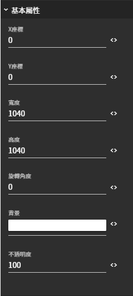

# 基本屬性

## 圖片預覽

## 設定值

### 基本屬性

* **X座標**
  * 繪圖區塊左上方為 0,0 \( X,Y \)
  * 往右邊為正
  * 往左邊為負
  * 例如：20（位置會在20,0 的位置）
* **Y座標**
  * 繪圖區塊左上方為 0,0 \( X,Y \)
  * 往下方為正
  * 往上方為負
  * 例如：20（位置會在0,20 的位置）
* **寬度** （區塊寬度，不可為負）
* **高度** （區塊高度，不可為負）
* **旋轉角度** （旋轉的角色，預設值為0）
* **背景** （區塊背景顏色，預設值為白色）
* **不透明度** （透明 0 ~ 100 不透明，預設值為100 ）

