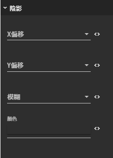

# 陰影

## 圖片預覽

## 設定值

### 陰影

* **X偏移**
  * 區塊正中心為 0,0 \( X,Y \)
  * 往右邊為正
  * 往左邊為負
  * 例如：5 \(陰影會往右邊偏移5px\)
* **Y偏移**
  * 區塊正中心為 0,0 \(X,Y\)
  * 往下方為正
  * 往上方為負
  * 例如：5 \(陰影會往下方偏移5px\)
* **模糊** （數值越大會越模糊，數值為負沒有效果）
* **顏色** （陰影的顏色，預設值為透明）

