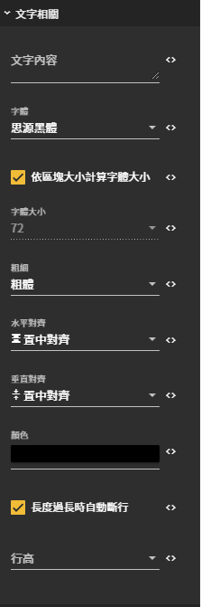

# 文字相關

## 圖片預覽

## 設定值

### 文字相關

* **文字內容** （區塊內的文字）
* **字體** （預設值思源黑體）
* **自動計算字體大小** （☑ 自動計算，☐自訂字體大小）
* **字體大小** （要取消自動計算才能設定字體大小）
* **粗細**
  * 細
  * 普通
  * 粗體
* **水平對齊**
  * 置左對齊
  * 置中對齊
  * 置右對齊
* **垂直對齊**
  * 分散對齊
  * 分散對齊\(頭尾留空\)
  * 置上對齊
  * 置中對齊
  * 置下對齊
* **顏色** （文字的顏色，預設值黑色）
* **自動斷行** （☑ 自動斷行，☐不斷行）
* **行高** （每行的間距）

