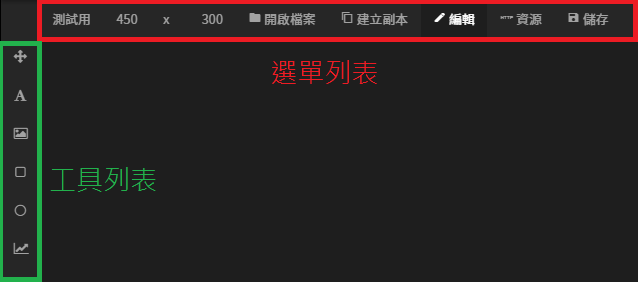
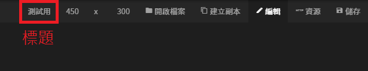
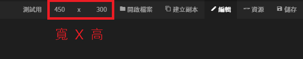
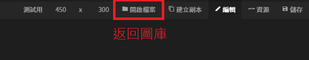
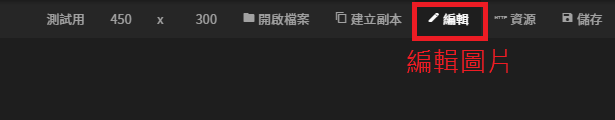
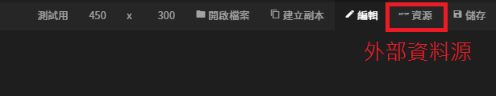

# 選單列表

## 選單列預覽

### 標題

#### 功能說明

* 點擊後，變更名稱

### 寬 X 高

#### 功能說明

* 點擊後，可以變更寬度與高度
* 卡片寬與高無法修改（ 450 X 300 ）
* 海報寬度無法修改（1040 X 1040）
* 圖片寬與高隨機調整（800 X 600 ）

### 開啟檔案

#### 功能說明

* 返回圖庫

### 建立副本

#### 功能說明

* 直接複製一張一模一樣的圖出來
* 圖標題後方會加入`_複製`（ 例如： 測試用\_複製 ）

### 編輯

#### 功能說明

* 編輯各式圖層設定

### 資料

#### 功能說明

* 引入外部資料源（ 宣告參數、API資料源 ）
* 宣告參數後，可將圖程式化呈現各式資料



### 儲存

#### 功能說明

* 儲存所有變更設定

