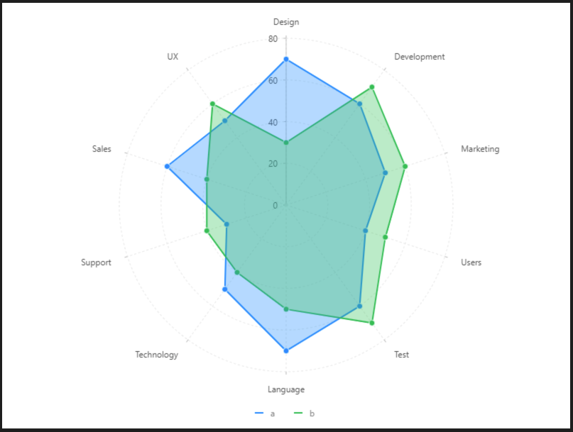

# 基礎雷達圖

### 圖片預覽



### 資料源

```javascript
[{
  item: 'Design',
  a: 70,
  b: 30
}, {
  item: 'Development',
  a: 60,
  b: 70
}, {
  item: 'Marketing',
  a: 50,
  b: 60
}, {
  item: 'Users',
  a: 40,
  b: 50
}, {
  item: 'Test',
  a: 60,
  b: 70
}, {
  item: 'Language',
  a: 70,
  b: 50
}, {
  item: 'Technology',
  a: 50,
  b: 40
}, {
  item: 'Support',
  a: 30,
  b: 40
}, {
  item: 'Sales',
  a: 60,
  b: 40
}, {
  item: 'UX',
  a: 50,
  b: 60
}]
```


### 內距

```javascript
50, 50, 80
```


### 前置處理函數 Transform

#### 字串展開（ fold ）

| 列表 | 設定值 |
| :--- | :--- |
| 類型 | 字串展開 |
| 要展開的欄位 | a,b |
| 保留欄位 | item |
| Key | user |
| Value | score |


### 比例尺 Scale

#### score（ Y軸 ）

| 列表 | 設定值 |
| :--- | :--- |
| 欄位 | score |
| 類型 | linear |
| 最小值 | 0 |
| 最大值 | 80 |


### 軸座標 Axis

#### item（ X軸 ）

| 列表 | 設定值 |
| :--- | :--- |
| 欄位 | item |
| 啟用 | 開啟 |
| 軸線 - 顏色 | transparent |


### 圖 Geom

#### 線圖（line ）

| 列表 | 設定值 |
| :--- | :--- |
| 欄位 | item\*score |
| 類型 | 線圖 |
| 顏色欄位 | user |
| 大小 | 2 |

#### 點圖（point ）

| 列表 | 設定值 |
| :--- | :--- |
| 欄位 | item\*score |
| 類型 | 點圖 |
| 顏色欄位 | user |
| 形狀 | circle |
| 大小 | 4 |
| 樣式 - 顏色 | \#ffffff |
| 樣式 - 寬度 | 1 |

#### 區域圖（ area ）

| 列表 | 設定值 |
| :--- | :--- |
| 欄位 | item\*score |
| 類型 | 區域圖 |
| 顏色欄位 | user |


### 圖示 Legend

| 列表 | 設定值 |
| :--- | :--- |
| 啟用 | 開啟 |
| 欄位 | user |
| 位置 | 下 |
| 排版 | 水平 |


### 極坐標 Coord

| 列表 | 設定值 |
| :--- | :--- |
| 類型 | 極坐標系 |




