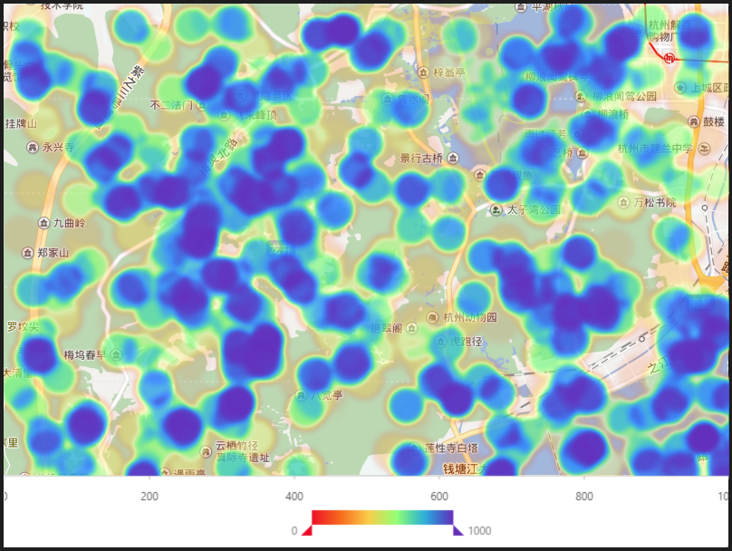

# 熱力圖

### 圖片預覽



### 圖片區塊

```javascript
圖檔：
https://gw.alipayobjects.com/zos/rmsportal/NeUTMwKtPcPxIFNTWZOZ.png

背景圖上疊加圖表
```


### 資料源

```javascript
https://antv.alipay.com/assets/data/heatmap.json
（資料來源：　AntV ）

格式：
[
{g: 541,l: 85,tmp: 858,},
{g: 937,l: 465,tmp: 299,},
......
]
```

### 

### 內距

```java
0,0,80,00
```


### 圖 Geom

#### 熱力圖（ heatmap ）

| 列表 | 設定值 |
| :--- | :--- |
| 欄位 | g\*l |
| 類型 | 熱力圖 |
| 顏色欄位 | tmp |
| 顏色 | \#F51D27,\#FA541C,\#FF8C12,\#FFC838, \#FAFFA8,\#80FF73,\#12CCCC,\#1890FF,\#6E32C2 |

### 基本屬性

| 列表 | 設定值 | 說明 |
| :--- | :--- | :--- |
| 背景 | transparent | 透明 |



