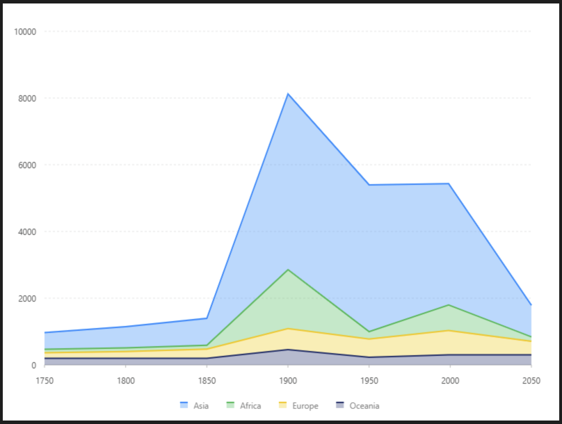

# 堆疊面積圖

### 圖片預覽



### 資料源

```javascript
[{
  country: 'Asia',
  year: '1750',
  value: 502
}, {
  country: 'Asia',
  year: '1800',
  value: 635
}, {
  country: 'Asia',
  year: '1850',
  value: 809
}, {
  country: 'Asia',
  year: '1900',
  value: 5268
}, {
  country: 'Asia',
  year: '1950',
  value: 4400
}, {
  country: 'Asia',
  year: '1999',
  value: 3634
}, {
  country: 'Asia',
  year: '2050',
  value: 947
}, {
  country: 'Africa',
  year: '1750',
  value: 106
}, {
  country: 'Africa',
  year: '1800',
  value: 107
}, {
  country: 'Africa',
  year: '1850',
  value: 111
}, {
  country: 'Africa',
  year: '1900',
  value: 1766
}, {
  country: 'Africa',
  year: '1950',
  value: 221
}, {
  country: 'Africa',
  year: '1999',
  value: 767
}, {
  country: 'Africa',
  year: '2050',
  value: 133
}, {
  country: 'Europe',
  year: '1750',
  value: 163
}, {
  country: 'Europe',
  year: '1800',
  value: 203
}, {
  country: 'Europe',
  year: '1850',
  value: 276
}, {
  country: 'Europe',
  year: '1900',
  value: 628
}, {
  country: 'Europe',
  year: '1950',
  value: 547
}, {
  country: 'Europe',
  year: '1999',
  value: 729
}, {
  country: 'Europe',
  year: '2050',
  value: 408
}, {
  country: 'Oceania',
  year: '1750',
  value: 200
}, {
  country: 'Oceania',
  year: '1800',
  value: 200
}, {
  country: 'Oceania',
  year: '1850',
  value: 200
}, {
  country: 'Oceania',
  year: '1900',
  value: 460
}, {
  country: 'Oceania',
  year: '1950',
  value: 230
}, {
  country: 'Oceania',
  year: '1999',
  value: 300
}, {
  country: 'Oceania',
  year: '2050',
  value: 300
}]
```


### 內距

```javascript
40,40, 80, 60
```


### 比例尺 Scale

#### year（ X軸 ）

| 列表 | 設定值 |
| :--- | :--- |
| 欄位 | year |
| 類型 | linear |
| 刻度間距 | 50 |
| 優化數據範圍 | 開啟 |


### 圖 Geom

#### 區域圖（ area ）

| 列表 | 設定值 |
| :--- | :--- |
| 欄位 | year\*value |
| 類型 | 區域圖 |
| 顏色欄位 | country |
| 調整欄位 | 堆疊 \| stack |

#### 線圖（ line ）

| 列表 | 設定值 |
| :--- | :--- |
| 欄位 | year\*value |
| 類型 | 線圖 |
| 顏色欄位 | country |
| 大小 | 2 |
| 調整欄位 | 堆疊 \| stack |


### 圖示 Legend

| 列表 | 設定值 |
| :--- | :--- |
| 啟用 | 開啟 |
| 欄位 | country |
| 位置 | 下 |
| 排版 | 水平 |




