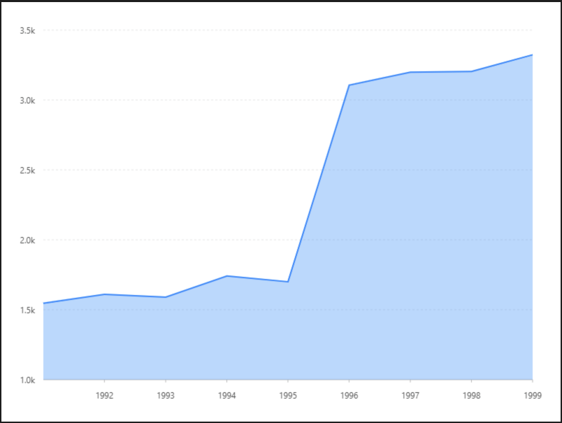

# 基礎面積圖

### 圖片預覽



### 資料源

```javascript
[{
  year: '1991',
  value: 15468
}, {
  year: '1992',
  value: 16100
}, {
  year: '1993',
  value: 15900
}, {
  year: '1994',
  value: 17409
}, {
  year: '1995',
  value: 17000
}, {
  year: '1996',
  value: 31056
}, {
  year: '1997',
  value: 31982
}, {
  year: '1998',
  value: 32040
}, {
  year: '1999',
  value: 33233
}]
```


### 內距

```javascript
40,40, 60, 60
```


### 比例尺 Scale

#### year（ X軸 ）

| 列表 | 設定值 |
| :--- | :--- |
| 欄位 | year |
| 類型 | linear |
| 刻度間距 | 1 |
| 優化數據範圍 | 開啟 |

#### value（ Y軸 ）

| 列表 | 設定值 |
| :--- | :--- |
| 欄位 | value |
| 類型 | linear |
| 優化數據範圍 | 開啟 |
| 最小值 | 10000 |
| 最大值 | 35000 |
| 格式化函數 | `function formatter(val) {   return (val / 10000).toFixed(1) + 'k'; }` |


### 圖 Geom

#### 區域圖（ area ）

| 列表 | 設定值 |
| :--- | :--- |
| 欄位 | year\*value |
| 類型 | 區域圖 |

#### 線圖（ Line ）

| 列表 | 設定值 |
| :--- | :--- |
| 欄位 | year\*value |
| 類型 | 線圖 |




