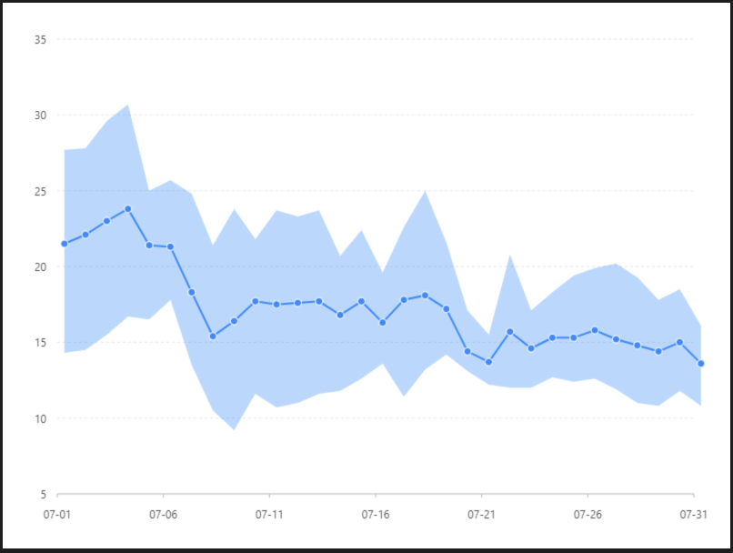

# 區間面積圖

### 圖片預覽



### 資料源

```javascript
[{
  time: 1246406400000,
  constest: 21.5,
  temperature: [14.3, 27.7]
}, {
  time: 1246492800000,
  constest: 22.1,
  temperature: [14.5, 27.8]
}, {
  time: 1246579200000,
  constest: 23,
  temperature: [15.5, 29.6]
}, {
  time: 1246665600000,
  constest: 23.8,
  temperature: [16.7, 30.7]
}, {
  time: 1246752000000,
  constest: 21.4,
  temperature: [16.5, 25.0]
}, {
  time: 1246838400000,
  constest: 21.3,
  temperature: [17.8, 25.7]
}, {
  time: 1246924800000,
  constest: 18.3,
  temperature: [13.5, 24.8]
}, {
  time: 1247011200000,
  constest: 15.4,
  temperature: [10.5, 21.4]
}, {
  time: 1247097600000,
  constest: 16.4,
  temperature: [9.2, 23.8]
}, {
  time: 1247184000000,
  constest: 17.7,
  temperature: [11.6, 21.8]
}, {
  time: 1247270400000,
  constest: 17.5,
  temperature: [10.7, 23.7]
}, {
  time: 1247356800000,
  constest: 17.6,
  temperature: [11.0, 23.3]
}, {
  time: 1247443200000,
  constest: 17.7,
  temperature: [11.6, 23.7]
}, {
  time: 1247529600000,
  constest: 16.8,
  temperature: [11.8, 20.7]
}, {
  time: 1247616000000,
  constest: 17.7,
  temperature: [12.6, 22.4]
}, {
  time: 1247702400000,
  constest: 16.3,
  temperature: [13.6, 19.6]
}, {
  time: 1247788800000,
  constest: 17.8,
  temperature: [11.4, 22.6]
}, {
  time: 1247875200000,
  constest: 18.1,
  temperature: [13.2, 25.0]
}, {
  time: 1247961600000,
  constest: 17.2,
  temperature: [14.2, 21.6]
}, {
  time: 1248048000000,
  constest: 14.4,
  temperature: [13.1, 17.1]
}, {
  time: 1248134400000,
  constest: 13.7,
  temperature: [12.2, 15.5]
}, {
  time: 1248220800000,
  constest: 15.7,
  temperature: [12.0, 20.8]
}, {
  time: 1248307200000,
  constest: 14.6,
  temperature: [12.0, 17.1]
}, {
  time: 1248393600000,
  constest: 15.3,
  temperature: [12.7, 18.3]
}, {
  time: 1248480000000,
  constest: 15.3,
  temperature: [12.4, 19.4]
}, {
  time: 1248566400000,
  constest: 15.8,
  temperature: [12.6, 19.9]
}, {
  time: 1248652800000,
  constest: 15.2,
  temperature: [11.9, 20.2]
}, {
  time: 1248739200000,
  constest: 14.8,
  temperature: [11.0, 19.3]
}, {
  time: 1248825600000,
  constest: 14.4,
  temperature: [10.8, 17.8]
}, {
  time: 1248912000000,
  constest: 15,
  temperature: [11.8, 18.5]
}, {
  time: 1248998400000,
  constest: 13.6,
  temperature: [10.8, 16.1]
}]
```


### 內距

```javascript
40, 40, 60, 60
```


### 比例尺 Scale

#### time（ X 軸 ）

| 列表 | 設定值 |
| :--- | :--- |
| 欄位 | time |
| 類型 | time |
| 優化數據範圍 | 開啟 |
| 時間格式 | MM-DD |

#### constest（Y軸 ）

| 列表 | 設定值 |
| :--- | :--- |
| 欄位 | constest |
| 類型 | linear |
| 優化數據範圍 | 開啟 |
| 最小值 | 5 |
| 最大值 | 35 |

#### temperature（ Y軸 ）

| 列表 | 設定值 |
| :--- | :--- |
| 欄位 | temperature |
| 類型 | linear |
| 優化數據範圍 | 開啟 |
| 最小值 | 5 |
| 最大值 | 35 |


### 軸座標 Axis

#### constest（ Y軸 ）

| 列表 | 設定值 |
| :--- | :--- |
| 欄位 | constest |
| 啟用 | 關閉 |


### 圖 Geom

#### 區域圖（ area ）

| 列表 | 設定值 |
| :--- | :--- |
| 欄位 | time\*temperature |
| 類型 | 區域圖 |

#### 線圖（ line ）

| 列表 | 設定值 |
| :--- | :--- |
| 欄位 | time\*constest |
| 類型 | 線圖 |
| 大小 | 2 |

#### 點圖（ point ）

| 列表 | 設定值 |
| :--- | :--- |
| 欄位 | time\*constest |
| 類型 | 點圖 |
| 形狀 | circle |
| 樣式 - 顏色 | \#ffffff |
| 樣式 - 寬度 | 1 |





