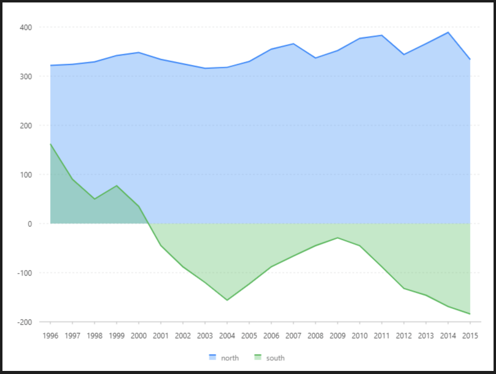

# 正負面積圖

### 圖片預覽



### 資料源

```javascript
[{
  year: '1996',
  north: 322,
  south: 162
}, {
  year: '1997',
  north: 324,
  south: 90
}, {
  year: '1998',
  north: 329,
  south: 50
}, {
  year: '1999',
  north: 342,
  south: 77
}, {
  year: '2000',
  north: 348,
  south: 35
}, {
  year: '2001',
  north: 334,
  south: -45
}, {
  year: '2002',
  north: 325,
  south: -88
}, {
  year: '2003',
  north: 316,
  south: -120
}, {
  year: '2004',
  north: 318,
  south: -156
}, {
  year: '2005',
  north: 330,
  south: -123
}, {
  year: '2006',
  north: 355,
  south: -88
}, {
  year: '2007',
  north: 366,
  south: -66
}, {
  year: '2008',
  north: 337,
  south: -45
}, {
  year: '2009',
  north: 352,
  south: -29
}, {
  year: '2010',
  north: 377,
  south: -45
}, {
  year: '2011',
  north: 383,
  south: -88
}, {
  year: '2012',
  north: 344,
  south: -132
}, {
  year: '2013',
  north: 366,
  south: -146
}, {
  year: '2014',
  north: 389,
  south: -169
}, {
  year: '2015',
  north: 334,
  south: -184
}]
```


### 內距

```javascript
40, 20, 80, 60
```


### 前置處理函數 Transform

#### 字串展開（ fold ）

| 列表 | 設定值 |
| :--- | :--- |
| 類型 | 字串展開 |
| 要展開的欄位 | north,south |
| 保留的欄位 | year |
| key | type |
| value | value |


### 圖 Geom

#### 面積圖（ area ）

| 列表 | 設定值 |
| :--- | :--- |
| 欄位 | year\*value |
| 類型 | 區域圖 |
| 顏色欄位 | type |

#### 線圖（ line ）

| 列表 | 設定值 |
| :--- | :--- |
| 欄位 | year\*value |
| 類型 | 線圖 |
| 顏色欄位 | type |
| 大小 | 2 |


### 圖示  Legend

| 列表 | 設定值 |
| :--- | :--- |
| 啟用 | 開啟 |
| 欄位 | value |
| 位置 | 下 |
| 排版 | 水平 |




