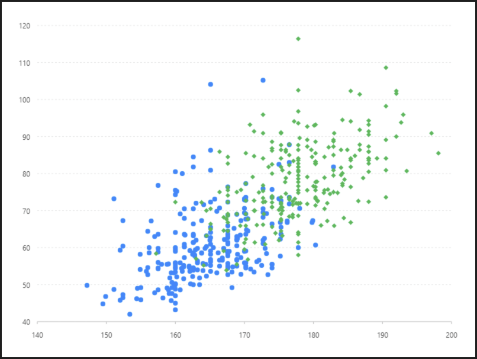

# 多形狀散點圖

### 圖片預覽




### 資料源

```javascript
https://antv.alipay.com/assets/data/scatter.json
（ 資料來源：AntV ）

格式：
[
{gender: "female",height: 161.2,weight: 51.6,},
{gender: "female",height: 167.5,weight: 59,},
......
]
```


### 內距

```javascript
40, 40, 60, 60
```


### 圖 Geom

#### 點圖（ point ）

| 列表 | 設定值 |
| :--- | :--- |
| 欄位 | height\*weight |
| 類型 | 點圖 |
| 顏色欄位 | gender |
| 形狀欄位 | gender |
| 形狀 | circle,diamond |
| 大小 | 4 |




