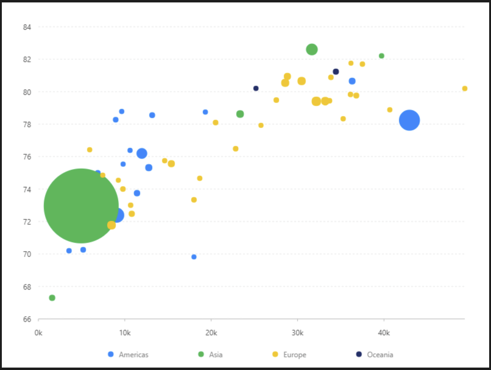

# 氣泡圖

### 圖片預覽



### 資料源

```javascript
https://antv.alipay.com/assets/data/bubble.json
（ 資料來源：AntV ）

格式：
[
{continent: "Americas",Country: "Argentina",LifeExpectancy: 75.32,GDP: 12779.37964,Population: 40301927,},
{continent: "Americas",Country: "Brazil",LifeExpectancy: 72.39,GDP: 9065.800825,Population: 190010647,}
......
]
```


### 內距

```javascript
40, 40, 80, 60
```


### 比例尺 Scale

#### GDP（ x軸 ）

| 列表 | 設定值 |
| :--- | :--- |
| 欄位 | GDP |
| 類型 | linear |
| 優化數據範圍 | 開啟 |
| 最小值 | 0 |
| 格式化函數 | `function formatter(value) { return (value / 1000).toFixed(0) + 'k'; }` |


### 圖 Geom

#### 點圖（ point ）

| 列表 | 設定值 |
| :--- | :--- |
| 欄位 | GDP\*LifeExpectancy |
| 類型 | 點圖 |
| 顏色欄位 | continent |
| 形狀 | circle |
| 大小欄位 | Population |
| 大小 | 4,65 |
| 調整欄位 | 擾動 \| jitter |


### 圖示 Legend

| 列表 | 設定值 |
| :--- | :--- |
| 啟用 | 開啟 |
| 欄位 | Population |
| 位置 | 下 |
| 排版 | 水平 |
| 水平偏移量 | 140 |
| 水平間距 | 80 |




