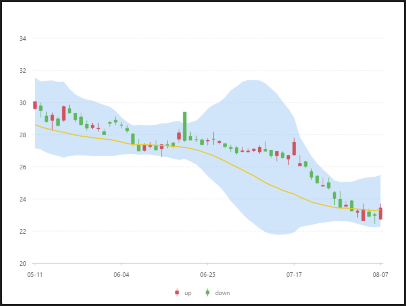

# 股票範圍面積圖



### 資料源

```javascript
https://antv.alipay.com/assets/data/stock-03.json
（資料來源： AntV ）

格式：
[{
date: 1186444800000,
range: [22.258032033902,25.4889359321959,],
start: 22.75,
end: 23.44,
lowest: 22.69,
highest: 23.7,
mean: 23.335,
trend: "up",
},{
date: 1186358400000,
range: [22.2381666799343,25.3786666401314,],
start: 23.03,
end: 22.97,
lowest: 22.44,
highest: 23.15,
mean: 23.285,
trend: "down",
},
......
]
```


### 內距

```javascript
40, 40, 80, 60
```


### 前置處理函數 Transform

數據加工（ map ）

| 列表 | 設定值 |
| :--- | :--- |
| 類型 | 數據加工 |
| 加工函數 | `function callback(obj) {  obj.stockRange = [obj.start, obj.end, obj.highest, obj.lowest];  return obj; }` |


### 比例尺 Scale

#### date（ X軸 ）

| 列表 | 設定值 |
| :--- | :--- |
| 欄位 | date |
| 類型 | time |
| 刻度數量 | 10 |
| 優化數據範圍 | 開啟 |
| 時間格式 | MM-DD |

#### range（ Y軸 ）

| 列表 | 設定值 |
| :--- | :--- |
| 欄位 | range |
| 類型 | linear |
| 刻度間距 | 2 |
| 優化數據範圍 | 開啟 |
| 最小值 | 20 |
| 最大值 | 35 |

#### mean（ Y軸 ）

| 列表 | 設定值 |
| :--- | :--- |
| 欄位 | mean |
| 類型 | linear |
| 優化數據範圍 | 開啟 |
| 最小值 | 20 |
| 最大值 | 35 |

#### stockRange（ Y軸 ）

| 列表 | 設定值 |
| :--- | :--- |
| 欄位 | stockRange |
| 類型 | linear |
| 優化數據範圍 | 開啟 |
| 最小值 | 20 |
| 最大值 | 35 |


### 軸座標 Axis

#### mean（ Y軸 ）

| 列表 | 設定值 |
| :--- | :--- |
| 啟用 | 關閉 |
| 欄位 | mean |

#### stockRange（ Y軸 ）

| 列表 | 設定值 |
| :--- | :--- |
| 啟用 | 關閉 |
| 欄位 | stockRange |


### 圖 Geom

#### 區域圖（ area ）

| 列表 | 設定值 |
| :--- | :--- |
| 欄位 | date\*range |
| 類型 | 區域圖 |
| 顏色 | \#64b5f6 |

#### K線圖（ schema ）

| 列表 | 設定值 |
| :--- | :--- |
| 欄位 | date\*stockRange |
| 類型 | K線圖 |
| 顏色 | `function(obj){  return (obj == 'up')? '#f04864' : '#2fc25b'; }` |
| 形狀 | candle |

#### 線圖（ line ）

| 列表 | 設定值 |
| :--- | :--- |
| 欄位 | date\*mean |
| 類型 | 線圖 |
| 顏色 | \#FACC14 |


### 圖示 Legend

| 列表 | 設定值 |
| :--- | :--- |
| 啟用 | 開啟 |
| 欄位 | trend |
| 位置 | 下 |
| 排版 | 水平 |




