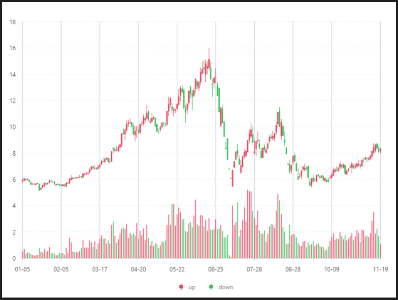

# 股票圖



### 資料源

```javascript
https://antv.alipay.com/assets/data/candle-sticks.json
（資料來源: AntV ）

格式:
[{
time: "2015-11-19",
start: 8.18,
max: 8.33,
min: 7.98,
end: 8.32,
volumn: 1810,
money: 14723.56,
},{
time: "2015-11-18",
start: 8.37,
max: 8.6,
min: 8.03,
end: 8.09,
volumn: 2790.37,
money: 23309.19,
},
......
]
```


### 內距

```javascript
40,30,80,40
```


### 前置處理函數 Transform

#### 數據加工（ map ）

| 列表 | 設定值 |
| :--- | :--- |
| 加工函數 | `function callback(obj) {  obj.trend = obj.start <= obj.end ? 'up' : 'down';  obj.range = [obj.start, obj.end, obj.max, obj.min];  return obj;  }` |


### 比例尺 Scale

#### time（X軸 ）

| 列表 | 設定值 |
| :--- | :--- |
| 欄位 | time |
| 類型 | timeCat |
| 刻度數量 | 10 |
| 優化數據範圍 | 開啟 |
| 時間格式 | MM-DD |

#### volumn（ Y軸 ）

| 列表 | 設定值 |
| :--- | :--- |
| 欄位 | volumn |
| 類型 | linear |
| 優化數據範圍 | 開啟 |
| 最小值 | 0 |
| 最大值 | 30000 |

#### range（ Y軸 ）

| 列表 | 設定值 |
| :--- | :--- |
| 欄位 | range |
| 類型 | linear |
| 刻度間距 | 2 |
| 優化數據範圍 | 開啟 |
| 最小值 | 0 |
| 最大值 | 18 |


### 軸座標 Axis

#### time（ X軸 ）

| 列表 | 設定值 |
| :--- | :--- |
| 欄位 | time |
| 啟用 | 開啟 |

#### volumn（ Y軸 ）

| 列表 | 設定值 |
| :--- | :--- |
| 欄位 | volumn |
| 啟用 | 關閉 |


### 圖 Geom

#### K線圖（ schema ）

| 列表 | 設定值 |
| :--- | :--- |
| 欄位 | time\*range |
| 類型 | K線圖 |
| 顏色欄位 | trend |
| 顏色 | `function(val) {  return (val == 'up')? '#f04864':'#2fc25b'; }` |
| 形狀 | candle |

#### 柱狀圖（ interval ）

| 列表 | 設定值 |
| :--- | :--- |
| 欄位 | time\*volumn |
| 類型 | 柱狀圖 |
| 顏色欄位 | trend |
| 顏色 | `function(val) {  return (val == 'up')? '#f04864':'#2fc25b'; }` |


### 圖示 Legend

| 列表 | 設定值 |
| :--- | :--- |
| 啟用 | 開啟 |
| 欄位 | range |
| 位置 | 下 |
| 排版 | 水平 |
| 水平偏移量 | 15 |




