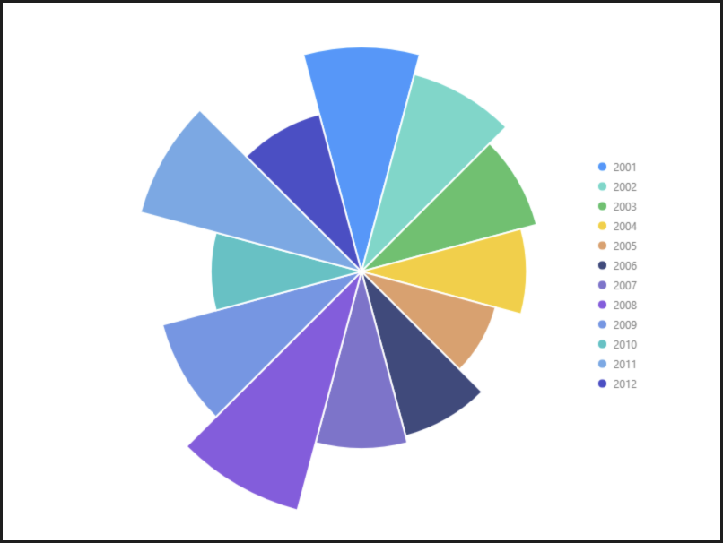

# 多色南丁格爾玫瑰圖

### 圖片預覽



### 資料源

```javascript
[{
  year: '2001',
  population: 41.8
}, {
  year: '2002',
  population: 38
}, {
  year: '2003',
  population: 33.7
}, {
  year: '2004',
  population: 30.7
}, {
  year: '2005',
  population: 25.8
}, {
  year: '2006',
  population: 31.7
}, {
  year: '2007',
  population: 33
}, {
  year: '2008',
  population: 46
}, {
  year: '2009',
  population: 38.3
}, {
  year: '2010',
  population: 28
}, {
  year: '2011',
  population: 42.5
}, {
  year: '2012',
  population: 30.3
}]
```


### 內距

```javascript
0
```


### 軸座標 Axis

#### population（ Y軸 ）

| 列表 | 設定值 |
| :--- | :--- |
| 欄位 | population |
| 啟用 | 關閉 |

#### year（ X軸 ）

| 列表 | 設定值 |
| :--- | :--- |
| 欄位 | year |
| 啟用 | 關閉 |


### 圖 Geom

#### 柱狀圖（ interval ）

| 列表 | 設定值 |
| :--- | :--- |
| 欄位 | year\*population |
| 類型 | 柱狀圖 |
| 顏色欄位 | year |
| 樣式 - 顏色 | \#ffffff |
| 樣式 - 寬度 | 2 |


### 圖示 Legend

| 列表 | 設定值 |
| :--- | :--- |
| 啟用 | 開啟 |
| 欄位 | year |
| 位置 | 右 |
| 排版 | 垂直 |
| 水平偏移量 | -160 |
| 垂直偏移量 | -160 |


### 極坐標 Coord

| 列表 | 設定值 |
| :--- | :--- |
| 類型 | 極坐標系 |





