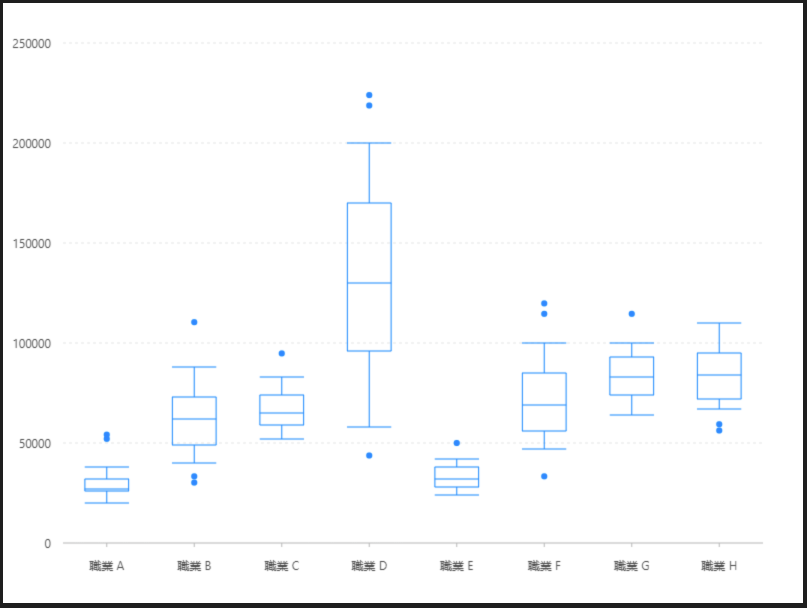

# 基礎箱型圖 \(有異常值\)

### 圖片預覽



### 資料源

```javascript
[{
  x: '職業 A',
  low: 20000,
  q1: 26000,
  median: 27000,
  q3: 32000,
  high: 38000,
  outliers: [50000, 52000]
}, {
  x: '職業 B',
  low: 40000,
  q1: 49000,
  median: 62000,
  q3: 73000,
  high: 88000,
  outliers: [32000, 29000, 106000]
}, {
  x: '職業 C',
  low: 52000,
  q1: 59000,
  median: 65000,
  q3: 74000,
  high: 83000,
  outliers: [91000]
}, {
  x: '職業 D',
  low: 58000,
  q1: 96000,
  median: 130000,
  q3: 170000,
  high: 200000,
  outliers: [42000, 210000, 215000]
}, {
  x: '職業 E',
  low: 24000,
  q1: 28000,
  median: 32000,
  q3: 38000,
  high: 42000,
  outliers: [48000]
}, {
  x: '職業 F',
  low: 47000,
  q1: 56000,
  median: 69000,
  q3: 85000,
  high: 100000,
  outliers: [110000, 115000, 32000]
}, {
  x: '職業 G',
  low: 64000,
  q1: 74000,
  median: 83000,
  q3: 93000,
  high: 100000,
  outliers: [110000]
}, {
  x: '職業 H',
  low: 67000,
  q1: 72000,
  median: 84000,
  q3: 95000,
  high: 110000,
  outliers: [57000, 54000]
}]
```


### 內距

```javascript
40, 40, 60, 60
```


### 前置處理函數 Transform

數據加工（ map ）

<table>
  <thead>
    <tr>
      <th style="text-align:left">&#x5217;&#x8868;</th>
      <th style="text-align:left">&#x8A2D;&#x5B9A;&#x503C;</th>
    </tr>
  </thead>
  <tbody>
    <tr>
      <td style="text-align:left">&#x985E;&#x578B;</td>
      <td style="text-align:left">&#x6578;&#x64DA;&#x52A0;&#x5DE5;</td>
    </tr>
    <tr>
      <td style="text-align:left">&#x52A0;&#x5DE5;&#x51FD;&#x6578;</td>
      <td style="text-align:left">
        <p><code>function callback(obj) {<br /> obj.range = [obj.low, obj.q1, obj.median, obj.q3, obj.high];<br /> return obj;</code>
        </p>
        <p><code>}</code>
        </p>
      </td>
    </tr>
  </tbody>
</table>

### 比例尺 Scale

#### range（ Y軸 ）

| 列表 | 設定值 |
| :--- | :--- |
| 欄位 | range |
| 類型 | linear |
| 優化數據範圍 | 開啟 |
| 最小值 | 0 |
| 最大值 | 250000 |

#### outliers（ Y軸 ）

| 列表 | 設定值 |
| :--- | :--- |
| 欄位 | outliers |
| 類型 | linear |
| 優化數據範圍 | 開啟 |
| 最小值 | 0 |
| 最大值 | 250000 |


### 軸座標 Axis

#### outliers（ Y軸 ）

| 列表 | 設定值 |
| :--- | :--- |
| 啟用 | 關閉 |
| 類型 | outliers |


### 圖 Geom

#### K線圖（ schema ）

| 列表 | 設定值 |
| :--- | :--- |
| 欄位 | x\*range |
| 類型 | K線圖 |
| 形狀 | box |

#### 點圖（ point ）

| 列表 | 設定值 |
| :--- | :--- |
| 欄位 | x\*outliers |
| 類型 | 點圖 |
| 形狀 | circle |
| 大小 | 3 |





