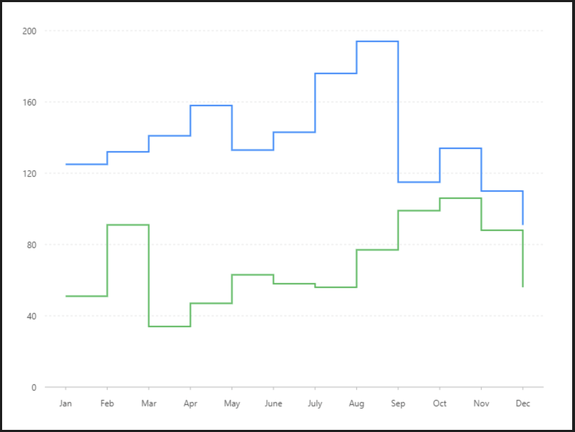

# 多條階梯折線圖

### 圖片預覽




### 資料源

```javascript
[{
  "month": "Jan",
  "key": "series1",
  "value": 125
}, {
  "month": "Jan",
  "key": "series2",
  "value": 51
}, {
  "month": "Feb",
  "key": "series1",
  "value": 132
}, {
  "month": "Feb",
  "key": "series2",
  "value": 91
}, {
  "month": "Mar",
  "key": "series1",
  "value": 141
}, {
  "month": "Mar",
  "key": "series2",
  "value": 34
}, {
  "month": "Apr",
  "key": "series1",
  "value": 158
}, {
  "month": "Apr",
  "key": "series2",
  "value": 47
}, {
  "month": "May",
  "key": "series1",
  "value": 133
}, {
  "month": "May",
  "key": "series2",
  "value": 63
}, {
  "month": "June",
  "key": "series1",
  "value": 143
}, {
  "month": "June",
  "key": "series2",
  "value": 58
}, {
  "month": "July",
  "key": "series1",
  "value": 176
}, {
  "month": "July",
  "key": "series2",
  "value": 56
}, {
  "month": "Aug",
  "key": "series1",
  "value": 194
}, {
  "month": "Aug",
  "key": "series2",
  "value": 77
}, {
  "month": "Sep",
  "key": "series1",
  "value": 115
}, {
  "month": "Sep",
  "key": "series2",
  "value": 99
}, {
  "month": "Oct",
  "key": "series1",
  "value": 134
}, {
  "month": "Oct",
  "key": "series2",
  "value": 106
}, {
  "month": "Nov",
  "key": "series1",
  "value": 110
}, {
  "month": "Nov",
  "key": "series2",
  "value": 88
}, {
  "month": "Dec",
  "key": "series1",
  "value": 91
}, {
  "month": "Dec",
  "key": "series2",
  "value": 56
}]
```


### 內距

```javascript
40,40,60,60
```


### 圖 Geom

#### 線圖（ Line ）

| 列表 | 設定值 |
| :--- | :--- |
| 欄位 | month\*value |
| 類型 | 線圖 |
| 顏色欄位 | key |
| 形狀 | hv |




