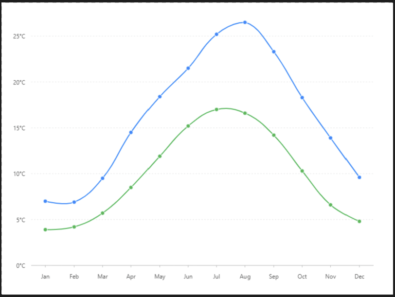

# 曲形折線圖

### 圖片預覽




### 資料源

```javascript
[{
  "month": "Jan",
  "city": "Tokyo",
  "temperature": 7
}, {
  "month": "Jan",
  "city": "London",
  "temperature": 3.9
}, {
  "month": "Feb",
  "city": "Tokyo",
  "temperature": 6.9
}, {
  "month": "Feb",
  "city": "London",
  "temperature": 4.2
}, {
  "month": "Mar",
  "city": "Tokyo",
  "temperature": 9.5
}, {
  "month": "Mar",
  "city": "London",
  "temperature": 5.7
}, {
  "month": "Apr",
  "city": "Tokyo",
  "temperature": 14.5
}, {
  "month": "Apr",
  "city": "London",
  "temperature": 8.5
}, {
  "month": "May",
  "city": "Tokyo",
  "temperature": 18.4
}, {
  "month": "May",
  "city": "London",
  "temperature": 11.9
}, {
  "month": "Jun",
  "city": "Tokyo",
  "temperature": 21.5
}, {
  "month": "Jun",
  "city": "London",
  "temperature": 15.2
}, {
  "month": "Jul",
  "city": "Tokyo",
  "temperature": 25.2
}, {
  "month": "Jul",
  "city": "London",
  "temperature": 17
}, {
  "month": "Aug",
  "city": "Tokyo",
  "temperature": 26.5
}, {
  "month": "Aug",
  "city": "London",
  "temperature": 16.6
}, {
  "month": "Sep",
  "city": "Tokyo",
  "temperature": 23.3
}, {
  "month": "Sep",
  "city": "London",
  "temperature": 14.2
}, {
  "month": "Oct",
  "city": "Tokyo",
  "temperature": 18.3
}, {
  "month": "Oct",
  "city": "London",
  "temperature": 10.3
}, {
  "month": "Nov",
  "city": "Tokyo",
  "temperature": 13.9
}, {
  "month": "Nov",
  "city": "London",
  "temperature": 6.6
}, {
  "month": "Dec",
  "city": "Tokyo",
  "temperature": 9.6
}, {
  "month": "Dec",
  "city": "London",
  "temperature": 4.8
}]
```


### 內距

```javascript
40,20,50,50
```


### 比例尺 Scale

#### temperature 比例尺 （ X軸 ）

| 列表 | 設定值 |
| :--- | :--- |
| 欄位 | temperature |
| 類型 | linear |
| 優化數據範圍 | 開啟 |
| 最小值 | 0 |
| 格式化函數 | `function (val) { return val + '°C'; }` |


### 圖 Geom

#### 點圖（ point ）

| 列表 | 設定值 |
| :--- | :--- |
| 欄位 | month\*temperature |
| 類型 | 點圖 |
| 顏色欄位 | city |
| 形狀 | circle |
| 大小 | 4 |
| 樣式 - 顏色 | \#ffffff |
| 顏色 - 寬度 | 1 |

#### 線圖（ Line ）

| 列表 | 設定值 |
| :--- | :--- |
| 欄位 | month\*temperature |
| 類型 | 線圖 |
| 顏色欄位 | city |
| 形狀 | smooth |





