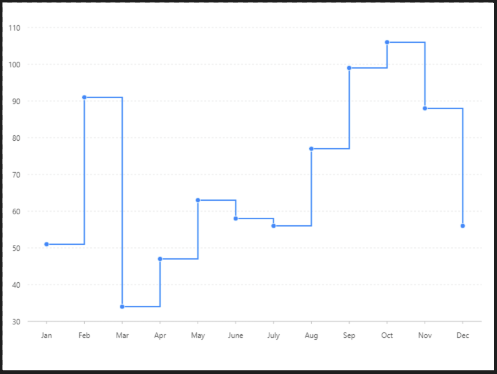

# 階梯折線圖

### 圖片預覽



###  資料源

```javascript
[{
  month: 'Jan',
  value: 51
}, {
  month: 'Feb',
  value: 91
}, {
  month: 'Mar',
  value: 34
}, {
  month: 'Apr',
  value: 47
}, {
  month: 'May',
  value: 63
}, {
  month: 'June',
  value: 58
}, {
  month: 'July',
  value: 56
}, {
  month: 'Aug',
  value: 77
}, {
  month: 'Sep',
  value: 99
}, {
  month: 'Oct',
  value: 106
}, {
  month: 'Nov',
  value: 88
}, {
  month: 'Dec',
  value: 56
}];
```


### 內距

```javascript
40,40,60,60
```


### 比例尺 Scale

#### month 比例尺（ X軸 ）

| 列表 | 設定值 |
| :--- | :--- |
| 欄位 | month |
| 類型 | cat |
| 優化數據範圍 | 開啟 |

#### value 比例尺 （ Y軸 ）

| 列表 | 設定值 |
| :--- | :--- |
| 欄位 | value |
| 類型 | linear |
| 刻度間距 | 10 |
| 優化數據範圍 | 開啟 |
| 最小值 | 30 |
| 最大值 | 110 |


### 圖 Geom

#### 線圖（ Line ）

| 列表 | 設定值 |
| :--- | :--- |
| 欄位 | month\*value |
| 類型 | 線圖 |
| 形狀 | hv |

#### 點圖（ point ）

| 列表 | 設定值 |
| :--- | :--- |
| 欄位 | month\*value |
| 類型 | 點圖 |
| 形狀 | circle |
| 樣式 - 顏色 | \#ffffff |
| 樣式 - 寬度 | 1 |




