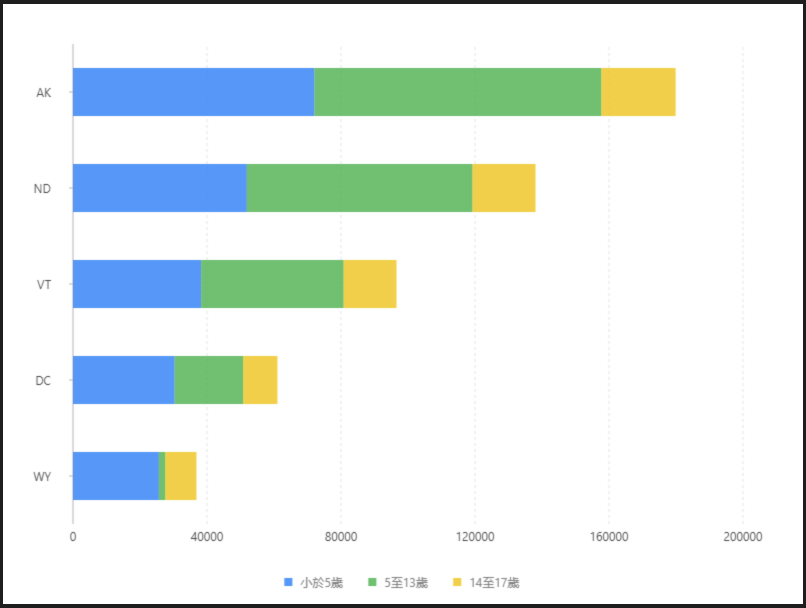

# 堆疊條形圖

### 圖片預覽




### 資料源

```javascript
[{
  'State': 'WY',
  '小於5歲': 25635,
  '5至13歲': 1890,
  '14至17歲': 9314
}, {
  'State': 'DC',
  '小於5歲': 30352,
  '5至13歲': 20439,
  '14至17歲': 10225
}, {
  'State': 'VT',
  '小於5歲': 38253,
  '5至13歲': 42538,
  '14至17歲': 15757
}, {
  'State': 'ND',
  '小於5歲': 51896,
  '5至13歲': 67358,
  '14至17歲': 18794
}, {
  'State': 'AK',
  '小於5歲': 72083,
  '5至13歲': 85640,
  '14至17歲': 22153
}]
```


### 內距

```javascript
40, 60, 80, 70
```


### 前置處理函數 Transform

#### 字串展開（fold ）

| 列表 | 設定值 |
| :--- | :--- |
| 類型 | 字串展開 |
| 要展開的欄位 | `小於5歲,5至13歲,14至17歲` |
| 保留欄位 | State |
| key | 年齡段 |
| value | 人口數量 |


### 圖 Geom

#### 柱狀圖（ interval ）

| 列表 | 設定值 |
| :--- | :--- |
| 欄位 | State\*人口數量 |
| 類型 | 柱狀圖 |
| 顏色欄位 | 年齡段 |
| 調整欄位 | 堆疊 \| stack |


### 圖示 Legend

| 列表 | 設定值 |
| :--- | :--- |
| 啟用 | 開啟 |
| 欄位 | 年齡段 |
| 位置 | 下 |
| 排版 | 水平 |


### 極坐標 Coord

| 列表 | 設定值 |
| :--- | :--- |
| 類型 | 直角坐標系 |
| 轉置 | true |




