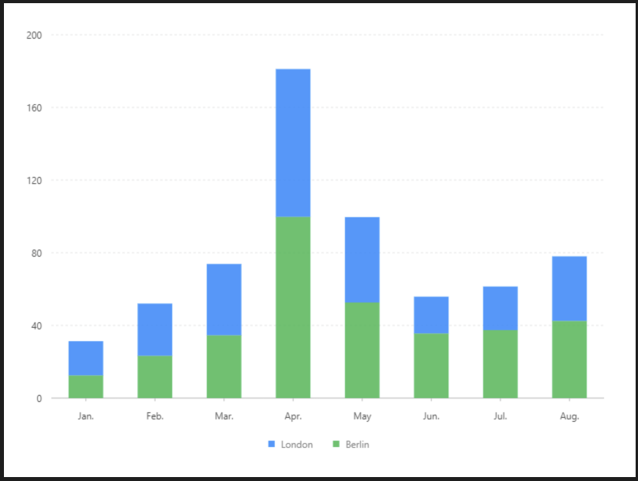

# 堆疊柱狀圖

### 圖片預覽



### 資料源

```javascript
[{
  name: 'London',
  'Jan.': 18.9,
  'Feb.': 28.8,
  'Mar.': 39.3,
  'Apr.': 81.4,
  'May': 47,
  'Jun.': 20.3,
  'Jul.': 24,
  'Aug.': 35.6
}, {
  name: 'Berlin',
  'Jan.': 12.4,
  'Feb.': 23.2,
  'Mar.': 34.5,
  'Apr.': 99.7,
  'May': 52.6,
  'Jun.': 35.5,
  'Jul.': 37.4,
  'Aug.': 42.4
}]
```


### 內距

```javascript
40, 40, 100, 60
```


### 前置處理函數 Transform

#### 字串展開（ fold ）

| 列表 | 設定值 |
| :--- | :--- |
| 類型 | 字串展開 |
| 要展開的欄位 | `Jan.,Feb.,Mar.,Apr.,May,Jun.,Jul.,Aug.` |
| 保留欄位 | name |
| key | key |
| value | value |


### 圖 Geom

#### 柱狀圖（ interval ）

| 列表 | 設定值 |
| :--- | :--- |
| 欄位 | key\*value |
| 類型 | 柱狀圖 |
| 顏色欄位 | name |
| 調整欄位 | 堆疊 \| stack |


### 圖示 Legend

| 列表 | 設定值 |
| :--- | :--- |
| 啟用 | 開啟 |
| 欄位 | key |
| 位置 | 下 |
| 排版 | 水平 |




